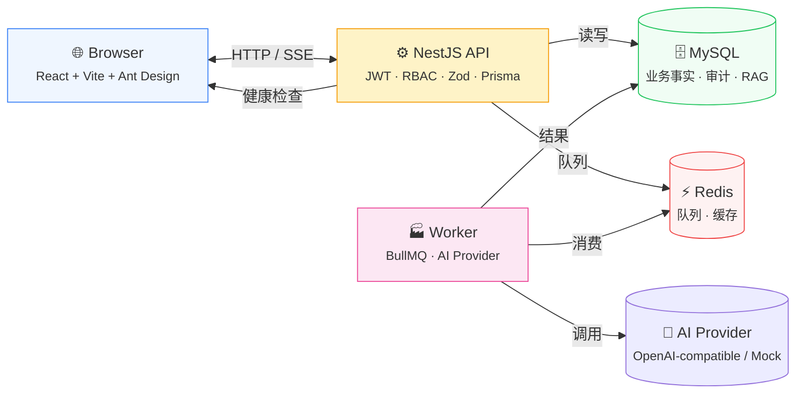
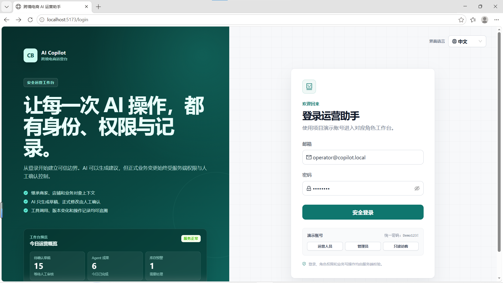
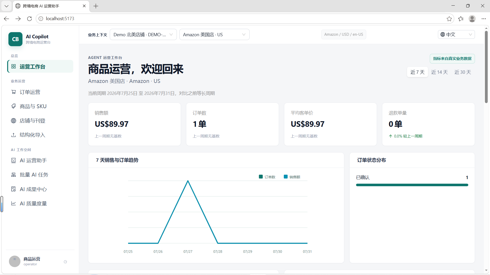
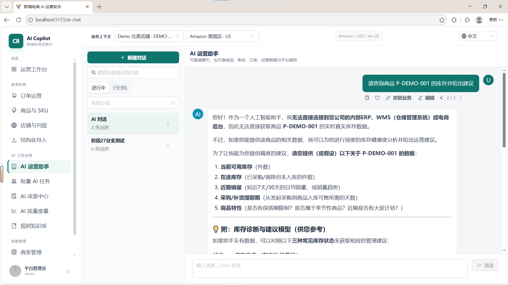
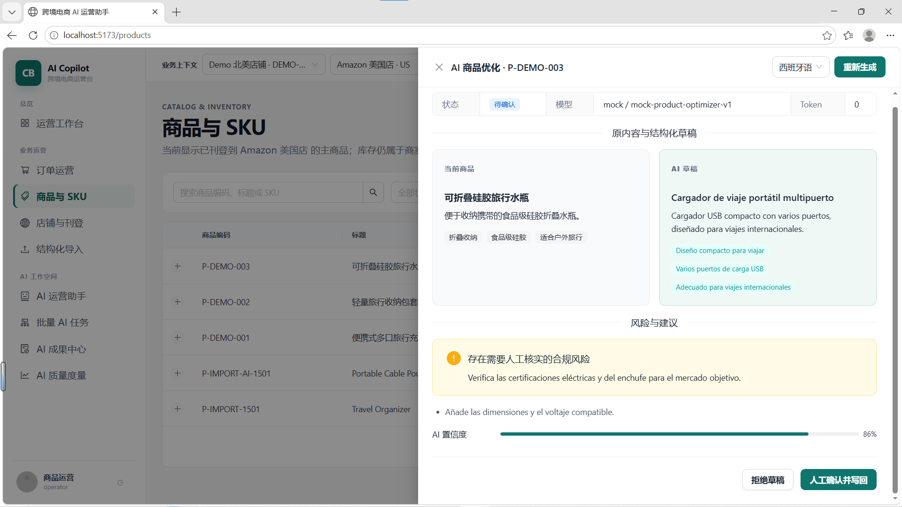
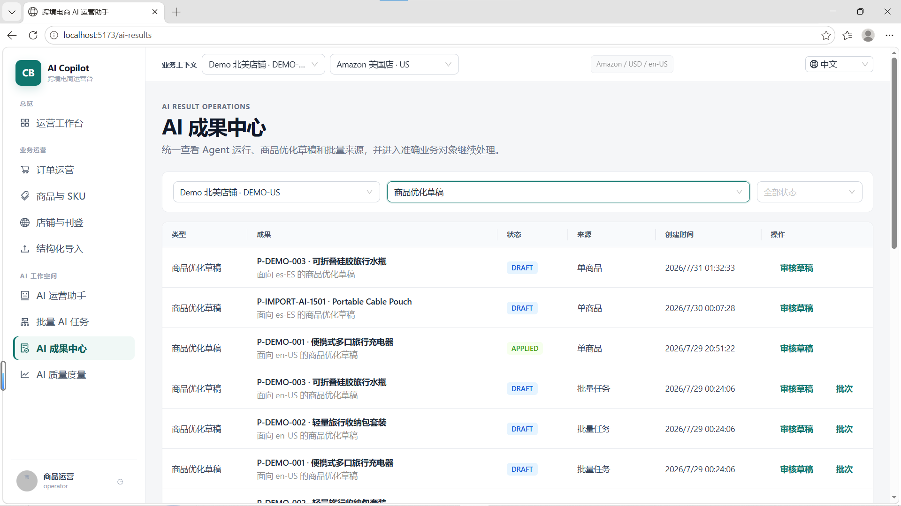
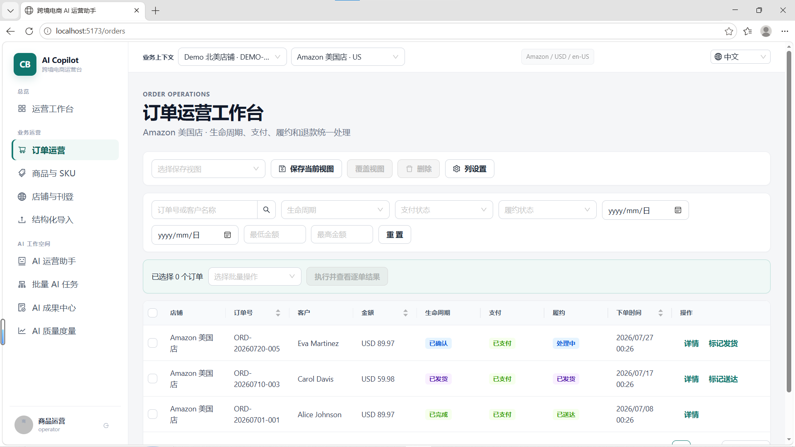
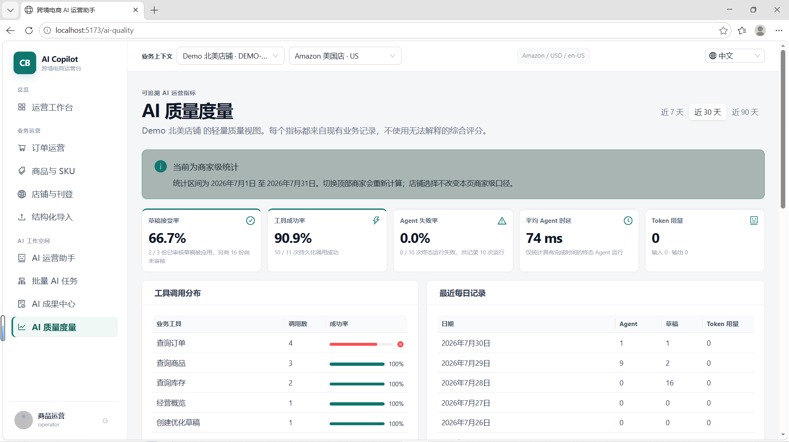

# Cross-Border E-commerce AI Copilot

> 🧭 **AI 全栈跨境电商运营助手** — 一个可运行、可测试、可面试演示的 B2B 管理后台。
>
> AI 不只聊天——它在明确权限、业务规则和人工确认机制下，参与真实的商品优化、订单查询、经营分析和规则检索。


---

## 目录

- [项目亮点](#项目亮点)
- [一分钟架构](#一分钟架构)
- [快速启动](#快速启动)
- [截图预览](#截图预览)
- [核心功能](#核心功能)
- [演示账号](#演示账号)
- [演示链路](#演示链路)
- [工程结构](#工程结构)
- [验证与质量](#验证与质量)
- [文档](#文档)

---

## 项目亮点

| 维度               | 说明                                                                           |
| ------------------ | ------------------------------------------------------------------------------ |
| 🧠 **AI 业务闭环** | 单商品优化 → 批量任务 → Agent Tool Calling → 规则 RAG，全链路可演示            |
| 🔐 **安全第一**    | 服务端 RBAC、商家隔离、人工确认写回、AI 只创建草稿不直接改数据                 |
| 🌐 **跨境多店铺**  | 一个商家管理多个店铺/渠道，商品刊登、订单、经营数据按店铺隔离                  |
| 🧪 **工程底线**    | 单元/组件/E2E + 真实 MySQL/Redis API 集成测试、Docker Compose 一键启动         |
| 📊 **AI 可度量**   | 草稿接受率、工具成功率、时延、Token — 全部可追溯，按商家隔离                   |
| 🎯 **面向面试**    | 8 分钟可演示从登录到 AI 优化写回的全闭环（[演示指南](docs/interview-demo.md)） |

---

## 一分钟架构



| 层              | 职责                                                              |
| --------------- | ----------------------------------------------------------------- |
| **Web**         | 交互、状态展示、前端权限提示 — 不是最终安全边界                   |
| **API**         | JWT 认证、RBAC、商家隔离、输入校验、事务、幂等、审计              |
| **Worker**      | 批量 AI 草稿 + 结构化商品导入；MySQL 保存最终状态，Redis 只做队列 |
| **AI Provider** | 统一封装流式输出、结构化结果和 Tool Calling；测试用零费用 Mock    |

---

## 快速启动

### 方式一：Docker 一键演示（推荐）

```powershell
Copy-Item .env.example .env
docker compose --profile app up --build -d
```

该命令会启动 MySQL、Redis、API、Worker 和 Web，并执行数据库迁移及演示数据初始化。启动后访问：

- Web：`http://localhost:5173`
- API 健康检查：`http://localhost:3000/api/health`
- Swagger：`http://localhost:3000/api/docs`

### 方式二：本地开发

先安装依赖、准备环境变量并启动基础设施：

```powershell
npm install
Copy-Item .env.example .env
npm run build --workspace @cross-border/shared

docker compose up -d mysql redis
npm run prisma:deploy --workspace @cross-border/api
npm run prisma:seed --workspace @cross-border/api
```

然后分别在三个终端中启动 API、Worker 和 Web：

```powershell
npm run dev:api
npm run dev:worker
npm run dev:web
```

> 本地开发要求 Node.js 20+、MySQL 8、Redis 7。未配置 `OPENAI_API_KEY` 时自动使用 Mock Provider。

真实模型通过 `OPENAI_API_KEY`、`OPENAI_BASE_URL` 和 `AI_MODEL` 配置。这里的 `OPENAI_*` 表示 **OpenAI 兼容协议**，并不限定只能使用 OpenAI 模型；SiliconFlow、阿里云百炼 Qwen 等提供兼容 Chat Completions 接口的服务均可接入。真实密钥只放在未提交的 `.env` 中。

---

## 截图预览

> 图片位于 `docs/screenshots/`，推送到 GitHub 后会自动渲染。

| 页面                                                                              | 预览                                                  |
| --------------------------------------------------------------------------------- | ----------------------------------------------------- |
| 🌐 **登录页**              | 中英文切换 · 一键填充 admin/operator/viewer           |
| 📊 **运营工作台**              | 经营指标 · 待办聚合 · 快捷 Agent · 后台任务           |
| 💬 **AI 运营助手**  | 统一 Agent 对话 · 连续追问 · Markdown 回复 · 消息复制 |
| 📦 **商品 AI 优化**    | 原文对比 · 多语草稿 · 合规风险 · 人工确认写回         |
| 🏆 **AI 成果中心**          | Agent 运行 · 商品草稿 · 批量任务 · 统一索引           |
| 📋 **订单运营**            | 保存视图 · 组合筛选 · 批量逐单操作 · 时间线           |
| 📈 **AI 质量度量**          | 接受率 · 成功率 · 时延 · Token · 按商家隔离           |

---

## 核心功能

### 🧠 AI 运营助手

- **统一 Agent 对话**：不再要求用户切换“普通对话 / 业务 Agent”；模型通过 `tool_choice=auto` 判断直接回答或调用服务端白名单工具，商品、SKU、库存、订单、经营数据和规则查找统一走 Agent
- **连续追问与消息资产**：Agent 结论写入原有服务端消息树，后续追问沿当前活动分支携带上下文，并直接复用分叉、收藏、业务关联、导出、内部分享和长上下文摘要
- **Tool Calling**：商品/SKU/库存查询、订单状态、经营概览、规则检索、创建优化草稿
- **持久执行与停止**：Agent 提交后立即返回 runId，由独立 BullMQ Worker 执行；Job 以 runId 防重并支持瞬时失败重试。停止状态通过 MySQL 传播到 Worker 的 AbortSignal，Agent 完成状态与最终会话消息在同一事务提交；即使停止早于 runId 返回，Web 也会补发服务端取消，避免后台任务失联
- **队列对账补偿**：Worker 启动时及运行期间扫描 MySQL 中超过安全窗口的 `PENDING/PLANNING` 记录并按业务 ID 重新投递，覆盖“数据库提交后、Redis 入队前进程退出”的双写窗口；语义明确为 at-least-once + 幂等消费 + 最终恢复
- **跨会话后台生成**：消息、运行状态和取消控制按会话隔离；切换后原会话继续运行，新会话可立即使用，后台结果不会覆盖当前视图
- **长上下文治理**：按估算 Token 预算装配“活动分支结构化摘要 + 最近原文”；摘要检查点可增量复用且不跨消息分支，摘要失败时安全退回近期原文
- **持久化分叉对话**：编辑用户消息或重新生成回答都会创建兄弟分支并保留原历史；活动叶节点由服务端持久化，刷新、切换会话后仍停留在所选血缘，分支导航可随时回看旧答案
- **消息呈现与复用**：AI/Agent 回复安全渲染 Markdown 与 GFM 表格，标题、强调、列表、引用和代码不再显示原始标记；已持久化的用户及助手消息均可一键复制原文
- **统一实时策略**：统一对话、工作台和订单页 Agent 均通过标准 `text/event-stream` 接收持久化快照、工具进度和终态，代理不支持 SSE 时自动退回有界 runId 查询；组件卸载只关闭订阅，不取消后台任务
- **Agent 上下文边界**：受控 ReAct 仍限制为最多 4 步/6 次工具调用；超大工具结果仅在模型回填时确定性裁剪并附带截断元数据，完整结果保留在审计记录
- **Provider 可靠性**：Prompt 集中版本化；模型调用设置显式超时和错误分类，结构化输出最多修复一次；单用户最多同时运行两个 Agent
- **显式写授权与 Prompt Injection 边界**：创建草稿必须由有写权限的用户显式授权并随 AgentRun 持久化，Worker 不使用文本关键词充当授权凭据；系统同时将工具结果、规则文档和商品文本视为不可信数据，Prompt 不能绕过工具白名单、RBAC、每次最多一份草稿或人工确认
- **服务端持久化**：会话历史、消息父子关系、人工标题保护、置顶、分组、归档/恢复

### 📦 商品与 AI 优化

- **商品管理**：多商家隔离 CRUD、SKU 管理、原子库存（禁止负库存、并发检测）
- **AI 单商品优化**：英语/西班牙语/葡萄牙语结构化草稿，含卖点、模型风险提示和置信度；没有规则引用的风险提示不包装为 RAG 合规结论
- **人工确认写回**：Product Service 事务写回 + 版本冲突检测 + 审计日志
- **批量 AI 优化**：BullMQ 队列，最多 20 商品，重试 3 次，可取消未执行项

### 📋 订单运营

- **多维状态**：生命周期 + 支付/履约/退款状态 + 状态机约束
- **保存视图**：筛选 + 排序 + 列配置 + 分页可恢复
- **批量操作**：逐单校验权限、状态机和幂等，部分失败可追溯
- **详情时间线**：商品、客户、地址、金额、物流、状态事件和操作日志

### 📊 运营工作台

- **经营指标**：近 7/14/30 天销售额、订单、客单价、退款 + 上一周期环比
- **待办聚合**：待处理订单、待确认草稿、失败任务、低库存
- **快捷 Agent**：继承当前商家、店铺和时间范围；viewer 只读，operator/admin 可创建草稿
- **后台任务**：运行中 Agent / 批量任务 + 近期 AI 成果

### 🔐 权限与安全

- **服务端 RBAC**：admin / operator / viewer，前端按钮只做体验提示
- **用户与权限管理**：管理员可新增、编辑、分配角色和商家范围、重置密码、启停及软删除用户；禁止操作当前账号和移除最后一个启用管理员
- **商家隔离**：Merchant 是数据隔离租户，复合外键防跨商家错误关联
- **AI 只写草稿**：Agent 不具备直接修改商品/库存/订单的工具；草稿工具还要求用户对本次运行显式授权
- **审计日志**：商品、订单、Agent 工具、批量任务、结构化导入、规则文档和用户权限等关键写操作全程记录
- **入口防护**：Helmet 安全响应头；登录按 IP + 邮箱、Refresh 按 IP、AI/Agent 按用户执行窗口限流；生产环境默认关闭 Swagger，并设置明确 JSON Body 上限

### 🩺 后端可靠性与可观测性

- **健康语义分离**：`/api/health/live` 只检查进程存活，`/api/health/ready` 并行检查 MySQL 与 Redis 并在依赖不可用时返回 503
- **统一错误契约**：4xx/5xx 均返回稳定 `code`、安全 `message`、`requestId`、时间和路径；5xx 不向客户端泄露堆栈、SQL 或 Provider 原始响应
- **轻量指标**：`/api/metrics` 暴露 Prometheus 文本格式的 HTTP 请求/5xx/耗时、Agent 状态与 Token、三条 BullMQ 队列状态；动态业务 ID 不进入标签
- **真实基础设施验证**：独立集成脚本从正式构建产物启动完整 Nest 应用，经 HTTP 验证 JWT、DTO、RBAC、商家隔离、MySQL 幂等、Redis Job、readiness 和 metrics

### 🌐 跨境多店铺

- **店铺管理**：Store 表示平台/市场/币种/语言/时区
- **商品刊登**：一个主商品在多个店铺拥有独立标题、价格、语言和发布状态
- **上下文切换**：全局商家/店铺切换器同步影响工作台、商品、订单、Agent

### 🌍 界面国际化

- **独立界面语言**：`zh-CN` / `en-US` 不与商品目标语言混用，选择结果持久化，并同步 Ant Design、日期、金额和数量格式
- **核心演示面覆盖**：登录、导航、业务上下文、运营工作台、订单运营、商品/SKU、优化审核、AI 成果中心、AI 质量、AI 运营助手和用户权限均使用集中翻译资源
- **防漏翻译**：自动测试要求每个中文资源键都有非空英文值；`npm run i18n:check` 阻止核心界面重新引入硬编码中文
- **内容边界**：商品名称、订单数据、用户输入和 AI 历史回复保留原始语言，不伪装成已经翻译的界面文案

### 📚 规则知识库 (RAG)

- **文档治理**：Markdown/纯文本确定性切分；维护平台、市场、类目、语言、版本和生效区间，新版本可事务替代并归档旧版本
- **前置过滤**：商家权限、ACTIVE 状态、平台/市场/类目和有效期均在相关性排序前生效
- **可解释检索**：BM25 风格中英文词法评分，保留标题/短语权重、查询覆盖率并优先返回不同文档的引用
- **可靠拒答**：综合分数、覆盖率和分数差距判断；超过 500 个候选时显式降级，不静默信任截断结果
- **引用安全闸**：Agent 生成后校验 `[R1]` 等编号必须来自本次工具结果，无来源、漏引用或伪造引用均降级为安全提示
- **离线评估**：38 条固定用例覆盖直接命中、改写、中英混合、多文档召回、困难负例与无答案场景；拆为 24 条 Development Set 和从 v3 起冻结的 14 条 Test Set，分别守住 Hit@1 ≥ 0.85、Recall@3 ≥ 0.95、MRR ≥ 0.90、拒答准确率 ≥ 0.875；不将小型固定集冒充生产效果

在仓库根目录运行 `npm run rag:eval` 可分别查看 Development、Test 和 Combined 的四项指标、未排在 Top 1 的问题及错误拒答明细；任何一组低于门槛时命令返回非零退出码。评测驱动的 Before/After 记录见 [`docs/rag-evaluation-log.md`](docs/rag-evaluation-log.md)。

### 📥 结构化导入

- **文件解析**：CSV/XLSX，工作表/表头选择，字段映射
- **安全边界**：5 MB / 10 工作表 / 1000 行 / 80 列，不执行公式和宏
- **行级校验**：有效/无效/警告/覆盖风险预览，预览不写业务数据
- **异步导入**：BullMQ 逐行处理，重试、幂等、取消未执行项，失败 CSV 下载

### 📈 AI 质量度量

- **核心指标**：草稿接受率、工具成功率、Agent 失败率、用户回答有帮助率、平均时延、Token 用量
- **时间窗口**：7/30/90 天，按商家隔离
- **可追溯**：分子/分母/每日记录，可打开原始 Agent/商品轨迹
- **无样本返回空**：不把固定评估集包装成生产质量结论
- **分层评测**：Mock Provider 继续承担免费 CI 回归；`npm run agent:eval:real` 在显式提供模型凭证时输出工具选择 F1、参数准确率、任务完成率、不安全写率、Token 和时延，不进入普通 CI

---

## 演示账号

种子数据创建 `DEMO-US` 商家、三个演示商品及 SKU、Amazon 美国店和 Shopee 巴西店。

| 角色     | 邮箱                     | 密码       | 能力                                    |
| -------- | ------------------------ | ---------- | --------------------------------------- |
| 管理员   | `admin@copilot.local`    | `Demo123!` | 管理商家/商品/用户/规则知识库/审计      |
| 运营人员 | `operator@copilot.local` | `Demo123!` | 商品/SKU/库存/AI 优化/批量任务/导入     |
| 只读用户 | `viewer@copilot.local`   | `Demo123!` | 查看商品/订单/报表，使用只读 Agent 工具 |

登录页 `http://localhost:5173/login` · 右上角可切换中英文界面。

---

## 演示链路

### 单商品 AI 优化闭环

1. 运营人员进入 **商品管理** → 点击演示商品的 **AI 优化**
2. 选择目标语言（英语/西班牙语/葡萄牙语）→ 生成结构化草稿
3. 对照原文与草稿，查看卖点、合规风险、建议和置信度
4. **人工确认并写回** — Product Service 事务写回 + 版本校验 + 审计
5. 进入审计接口 `GET /api/merchants/:merchantId/audit-logs` 验证

### 管理员用户与权限演示

1. 使用管理员账号进入 **用户与权限** → 新增一个测试用户
2. 分配 operator/viewer 角色与可访问商家 → 使用该账号登录验证菜单和数据范围
3. 编辑用户资料、重置密码并停用账号 → 确认已有 Refresh Token 被撤销且账号无法继续访问
4. 重新启用后执行软删除 → 确认历史业务关系和审计记录仍然保留
5. 尝试停用当前账号或最后一个启用管理员 → 确认服务端拒绝高风险操作

### Agent Tool Calling 演示

1. 进入 **AI 运营助手**，直接输入业务问题，无需切换模式
2. 依次尝试：商品库存查询 → 演示订单查询 → 经营看板 → 规则检索
3. 提交后观察工具轨迹实时更新 — 每次工具执行完立即落库并轮询展示
4. 输入“先查 P-DEMO-001 的库存，再创建英文优化草稿” — 模型拿到库存结果后才在下一轮创建草稿
5. 回到商品管理中进行人工确认 — 正式商品不会被 Agent 直接修改

### AI 会话生产力演示

1. 在会话 A 发起生成，回复仍在流式输出时切换到会话 B
2. 确认 B 的输入区可立即使用，侧栏 A 显示生成中；A 完成后 B 的消息不被覆盖
3. 切回 A 查看完整结果；再次生成并点击停止，确认只停止当前 A，部分回复已保存
4. 重命名、分组、置顶 → 用标题或消息搜索
5. 收藏消息 → 使用 `P-DEMO-001` 或演示订单号关联业务对象
6. 导出脱敏 Markdown/JSON（无客户邮箱/电话/地址）
7. 分享给同商家只读用户 → 撤销分享 → 原链接显示 410
8. 归档会话 → 确认从活动列表消失 → 二次确认永久删除

### 批量 AI 任务演示

1. 进入 **批量 AI 任务** → **新建批量优化**
2. 选择三个演示商品 + 目标语言 → 提交后观察进度自动刷新
3. 打开任务详情 → 检查每个商品的尝试次数、状态、草稿编号
4. 回到商品管理逐个审核草稿 → 人工确认前正式商品不变

### 结构化导入演示

1. 进入 **结构化导入** → 上传[示例 CSV](docs/examples/product-import-template.csv)
2. 设置表头行 → 选择工作表 → 完成字段映射
3. 预览有效/无效/警告行 — 确认此时未写业务数据
4. 选择"仅导入草稿"或"导入后创建 AI 优化" → 提交
5. 打开任务详情 → 查看逐行结果和深链接；失败行可下载 CSV

### 规则 RAG 演示

1. 管理员进入 **规则知识库** → 选择 `DEMO-US` 商家
2. 搜索"充电器需要核对哪些认证" → 检查引用编号和原文摘录
3. 搜索"宠物食品冷链温度要求" → 确认系统显示信息不足
4. 导入一份"仅当前商家"的 Markdown 规则 → 验证切分和检索
5. 归档文档 → 确认不再参与检索

### 订单运营工作台演示

1. 进入 **订单** → 组合选择店铺/生命周期/支付/履约/时间/金额筛选
2. 保存当前视图 → 重置页面 → 恢复视图确认配置完整
3. 选择不同状态的订单 → 批量确认/发货 → 弹窗逐单显示成功/拒绝
4. 打开订单详情 → 查看商品、客户、地址、金额、物流和时间线
5. 切换到 **订单 Agent** → 确认工具轨迹不包含客户邮箱或完整地址

---

## 工程结构

```text
apps/
├── web/       React + Vite + Ant Design    # 页面、组件、hooks 同目录共置
├── api/       NestJS + Prisma + MySQL       # 业务 API + JWT/RBAC
└── worker/    BullMQ Worker                 # 异步批量任务 + AI Provider
packages/
└── shared/    共享 Schema、认证类型与基础类型

docs/          架构说明 · 面试演示指南 · 产品路线 · 质量路线
ai-chat/       原 AI 聊天项目（只读参考）
ecommerce-admin/ 原电商后台项目（只读参考）
```

> Web 页面按路由懒加载，基础框架库按组拆分 vendor chunk；2026-08-15 生产构建最大业务页面 chunk 198.89 kB（gzip 60.98 kB）。复杂页面（订单、AI 对话、商品）采用薄组合层：副作用进 hooks，UI 拆为独立组件。

---

## 验证与质量

```powershell
npm run verify
```

依次执行：格式化检查 → ESLint → TypeScript 类型检查 → 自动化测试 → 生产构建。

CI 还会在全新 MySQL 8.4 / Redis 7.4 服务上执行迁移和 `npm run test:integration`，该测试不会清空共享数据库，只清理带唯一前缀的自身数据。普通 `npm test` 保持无基础设施、快速且可重复。

核心浏览器旅程使用独立 Playwright 命令，避免没有浏览器或 Compose 的普通 CI/单测环境被误伤：

```powershell
docker compose --profile app up --build -d
npm run test:e2e:install --workspace @cross-border/web
npm run test:e2e
```

三条 E2E 分别覆盖 operator 进入商品 AI 人工审核链路、viewer 无写操作入口，以及界面语言切换。默认演示环境使用 Mock Provider，不调用收费模型。

**233 项快速单元/组件测试 + 4 条真实 MySQL/Redis API 集成检查 + 3 条核心浏览器 E2E**覆盖：

- 认证与 RBAC（登录、角色路由、用户 CRUD、当前账号/最后管理员保护、令牌撤销、商家隔离、viewer 403）
- 商品（分页隔离、负库存、跨商家失败）
- 订单（多维状态机、组合筛选、保存视图、批量部分失败、事件追溯）
- AI 会话（RAF 流式合帧、完成/停止强制刷新、流式持久化、会话级后台生成与定向取消、跨会话竞态隔离、编辑/重新生成分叉、活动叶节点与分支切换、活动分支摘要检查点、Token 预算、摘要失败降级、Markdown/GFM 渲染、消息复制、归档/删除、收藏/关联、导出脱敏、分享授权/撤销/过期）
- 商品优化（三种语言结构化校验、人工确认写回、版本冲突、重复确认幂等）
- Agent Tool Calling（受控 ReAct 循环、依赖链两轮规划、步骤/调用/工具结果预算、参数校验、完整工具审计、订单脱敏、viewer 只读边界、规划评估集工具选择准确率 1.0）
- 批量任务（商家隔离、幂等、取消、重试、重复投递）
- 规则 RAG（商家过滤、拒答、评估集 Recall@3=1.0）
- 结构化导入（CSV/XLSX 解析边界、预览零写入、键序无关幂等）
- AI 质量（聚合、空样本、商家和时间窗口缓存隔离）
- 国际化（中英文切换、金额/日期格式化、资源键完整性、核心界面硬编码检查、AI 会话英文控件）
- 服务端状态（缓存键、精确失效、切换上下文不覆盖、局部请求乱序隔离）
- 前端可达性（主要页面语义、viewer 非交互状态、会话选择与菜单键盘边界）

CI（GitHub Actions）在真实 MySQL/Redis 上运行迁移 + 验证，并分别构建 API/Worker/Web 镜像。

## API 端点

| 端点                                     | 说明                 |
| ---------------------------------------- | -------------------- |
| `http://localhost:3000/api/health`       | 健康检查             |
| `http://localhost:3000/api/health/live`  | 进程存活检查         |
| `http://localhost:3000/api/health/ready` | MySQL/Redis 就绪检查 |
| `http://localhost:3000/api/metrics`      | Prometheus 运行指标  |
| `http://localhost:3000/api/docs`         | Swagger 文档         |

---

## 文档

| 文档                                                              | 说明                                          |
| ----------------------------------------------------------------- | --------------------------------------------- |
| [AI 全功能面试讲解手册](docs/interview-ai-complete-guide.md)      | AI 架构、完整链路、STAR 与追问                |
| [前端完整面试讲解手册](docs/interview-frontend-complete-guide.md) | React 架构、业务页面、可靠性、STAR 与演进边界 |
| [架构与关键取舍](docs/architecture.md)                            | 系统边界、数据流、核心链路设计                |
| [8 分钟面试演示指南](docs/interview-demo.md)                      | 面试场景演示脚本                              |
| [产品体验增强路线](docs/product-enhancement-roadmap.md)           | 阶段 11-16 产品路线                           |
| [前端与 AI 质量增强路线](docs/frontend-quality-roadmap.md)        | 阶段 17-23 质量路线                           |

---

> **作品集说明**：本项目是校招“AI 全栈偏前端”岗位作品集。阶段 0-36 已完成业务闭环、工程治理、作品集呈现、完整用户权限管理、跨会话生成与取消竞态治理、长上下文与分叉对话、统一 Agent 会话入口、消息呈现增强、核心界面国际化治理和 AI 面试知识沉淀；后续只修复可验证的体验与质量缺口，不再增加业务领域。不暴露真实密钥或个人数据。
