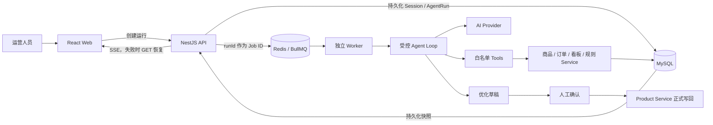

# 跨境电商 AI Copilot：AI 全功能面试讲解手册

> 适用场景：校招项目介绍、AI 全栈岗位面试、项目深挖与现场演示。  
> 事实基线：阶段 0—35；192 项自动化测试；规则 RAG 固定评测集 38 条。  
> 表达原则：只讲代码中已经实现的能力；缺陷与未来演进分开，不把小型离线评测包装成生产准确率。

## 1. 一句话介绍

这是一个面向跨境电商运营人员的 AI 全栈业务系统：用户可以用自然语言查询商品、库存、订单、经营数据和平台规则，也可以让 Agent 创建结构化商品优化草稿；所有读取都受服务端 RBAC 和商家/店铺边界保护，所有正式写回都必须经过人工确认、版本校验和审计。

它不是“在管理后台中嵌入一个聊天框”，而是让 AI 在明确的权限、工具、预算、状态和人工确认机制下参与真实业务。

## 2. AI 能力全景

| 能力               | 已实现内容                                          | 解决的问题                             |
| ------------------ | --------------------------------------------------- | -------------------------------------- |
| 统一 AI 对话       | 服务端会话、消息树、分叉、长上下文、后台生成        | 对话可持续、可恢复、不会串会话         |
| Agent Tool Calling | 受控 ReAct、6 个白名单工具、Zod 参数校验            | 模型能查询真实业务，但不能任意操作系统 |
| 商品 AI 优化       | 三语结构化草稿、风险提示、置信度、人工确认          | AI 结果从文本建议变成可审核业务对象    |
| 规则 RAG           | 文档导入、切分、范围过滤、BM25 风格检索、引用与拒答 | 平台规则回答可追溯，信息不足时不编造   |
| 异步任务           | BullMQ、独立 Worker、重试、取消、幂等               | 长耗时 AI 任务不占用单次 HTTP 请求     |
| 批量优化           | 每商品独立任务项、进度、失败明细、取消              | 支撑小规模真实运营任务                 |
| AI 成果中心        | AgentRun、草稿、导入结果统一检索和深链接            | AI 结果有去向，可以继续审核和处理      |
| AI 质量度量        | 接受率、工具成功率、失败率、时延、Token、反馈原因   | 不只看接口成功，还能分析业务效果       |
| 安全边界           | RBAC、商家隔离、显式写授权、脱敏、审计              | 防止越权、提示注入和未经确认的正式写入 |

## 3. 总体架构



架构选择是模块化单体，而不是微服务。项目体量和团队规模不需要服务拆分，模块化单体更容易保证事务、权限、演示和测试闭环；API 与 Worker 仍然按进程职责拆开。

## 4. 一次 AI 对话的完整执行过程

### 4.1 用户提交问题

AI 对话页将当前商家、店铺、会话、父消息和本次草稿授权一起提交。用户不需要选择“普通聊天”或“Agent 模式”，所有输入统一进入 Agent，由模型决定直接回答还是调用工具。

前端核心代码：

- `apps/web/src/pages/ai-chat/hooks/use-ai-messages.ts`
- `apps/web/src/pages/ai-chat/ai-chat.page.tsx`
- `apps/web/src/api/agent.ts`

### 4.2 API 做确定性校验

API 在模型参与前完成：

1. JWT 身份校验；
2. 用户状态和角色校验；
3. 商家访问范围校验；
4. 店铺是否属于当前商家校验；
5. 单用户并发 Agent 数量限制；
6. 会话归属和父消息关系校验；
7. 创建用户消息与 `AgentRun`。

模型不能决定用户有没有权限，这些都是服务端确定性规则。

### 4.3 运行入队并立即返回

API 使用 `runId` 作为 BullMQ Job ID。接口创建运行后立即返回，不等待模型完成。

这样设计的原因：

- 模型调用时间不稳定；
- 浏览器断开不应该丢失任务；
- Worker 可以统一处理重试和取消；
- MySQL 可以保存最终业务事实；
- Redis 只负责队列和短期调度，不作为最终状态来源。

核心代码：

- `apps/api/src/ai/agent-queue.service.ts`
- `apps/api/src/ai/agent-runs.service.ts`
- `apps/api/src/ai/agent-processor.service.ts`
- `apps/worker/src/main.ts`

### 4.4 Worker 重建可信执行上下文

Worker 只根据 `runId` 从 MySQL 恢复：

- 用户及当前角色；
- 用户可访问的商家；
- 当前商家和店铺；
- 会话及本轮用户消息；
- 经营数据时间范围；
- Prompt 版本；
- 本次是否显式授权创建草稿。

队列参数不是权限凭据。即使有人伪造队列数据，工具执行时仍会经过业务 Service 的权限和商家边界。

### 4.5 构建当前会话分支上下文

消息以父子树保存。编辑历史问题或重新生成回答时会创建兄弟分支，不覆盖旧消息。模型只读取当前活动叶节点的祖先血缘，因此被放弃的分支不会污染新回答。

长对话采用以下组合：

1. 当前活动分支的结构化摘要检查点；
2. 最近原始消息；
3. 估算 Token 预算；
4. 可复用的增量摘要；
5. 摘要失败时退回近期原文。

这里的重点不是“无限上下文”，而是在有限 Token 预算内保留业务实体、用户约束、已完成动作和未解决问题。

核心代码：

- `apps/api/src/ai/ai.service.ts`
- `apps/api/src/ai/ai-sessions.service.ts`
- `apps/api/src/ai/context-budget.ts`
- `apps/web/src/pages/ai-chat/branching.ts`

### 4.6 执行受控 ReAct 循环

Agent 每一步都让模型在两种行为中选择：

- 返回工具调用；
- 收敛为最终答案。

系统设置硬预算：

- 最多 4 个 Agent 步骤；
- 最多 6 次工具调用；
- 整次运行最多约 16,000 Token；
- 单次回填模型的工具结果有独立裁剪预算；
- 达到最后一步或预算不足时强制结束规划。

每次工具调用都会立即持久化，而不是等整个 Agent 完成后一次性写入。这样运行失败后仍能看到执行到了哪一步。

核心代码：

- `apps/api/src/ai/agent.service.ts`
- `apps/api/src/ai/context-budget.ts`
- `apps/api/src/ai/agent-runs.service.ts`

### 4.7 SSE 展示进度并支持恢复

统一 Agent 对话中的“流式”是运行状态和工具轨迹的 SSE 快照流，不应表述为逐 Token 输出：

- API 持续发送持久化的 AgentRun 快照；
- 前端实时展示规划、工具调用和最终结论；
- SSE 不可用时退化为有界 GET 查询；
- 切换会话只关闭当前视图订阅，不取消后台任务；
- 后台完成后只更新所属会话，不覆盖当前会话。

Provider 层仍具有普通文本流接口，但统一业务 Agent 为了可恢复执行采用 runId + SSE 快照方案。

## 5. AI Provider 抽象

项目保持单一 Provider 接口，负责：

- 普通文本对话；
- 标题生成；
- 商品结构化优化；
- Agent 单步规划；
- 流式输出；
- 超时与取消；
- Token 用量；
- Provider 和模型名称记录。

目前有：

- `MockAiProvider`：自动化测试和本地无密钥演示；
- OpenAI 兼容 Provider：通过环境变量接入兼容接口。

结构化商品输出第一次校验失败时允许进行一次受控修复，之后仍失败则记录安全错误，不无限重试。

核心代码：`apps/api/src/ai/ai-provider.service.ts`。

## 6. Agent 工具体系

### 6.1 六个白名单工具

| 工具                                | 输入                   | 输出与边界                               |
| ----------------------------------- | ---------------------- | ---------------------------------------- |
| `search_products`                   | 可选关键词             | 当前商家/店铺商品摘要                    |
| `get_inventory`                     | 商品编码               | SKU 与库存，不跨商家                     |
| `get_order_status`                  | 订单号                 | 脱敏订单投影，不返回邮箱、电话和完整地址 |
| `get_business_overview`             | 无额外参数             | 当前上下文经营概览                       |
| `search_platform_rules`             | 查询、平台、市场、类目 | 带来源的规则结果或明确拒答               |
| `create_product_optimization_draft` | 商品编码、目标语言     | 待人工确认草稿，不修改正式商品           |

### 6.2 Schema 单一事实来源

每个工具输入先用 Zod 定义，再从同一 Zod Schema 生成给模型看的 JSON Schema，因此不会出现“模型看到的参数定义”和“服务端真实校验规则”长期漂移。

### 6.3 工具执行边界

- 工具名称必须在白名单中；
- 参数必须通过严格 Schema，未知字段被拒绝；
- 工具只调用业务 Service，不直接访问 Prisma；
- 每次调用记录输入、输出、错误、开始时间、完成时间和耗时；
- `runId + externalCallId` 唯一防重；
- 完整结果进入审计，回填模型的超大结果被确定性裁剪；
- 工具和 RAG 返回内容都被 Prompt 标记为不可信数据，不能作为系统指令执行。

核心代码：

- `apps/api/src/ai/agent-tools.contract.ts`
- `apps/api/src/ai/agent-tools.service.ts`

## 7. 写操作与人工确认

### 7.1 为什么不让 Agent 直接改商品

模型输出具有概率性，正式商品内容又会影响实际销售，所以系统使用“草稿—确认—写回”三段式：

1. Agent 或商品页创建结构化优化草稿；
2. 用户比较原文、建议稿、风险和置信度；
3. 人工确认后由 Product Service 正式写回。

Agent 没有修改商品、调整库存或更新订单的正式写工具。

### 7.2 显式草稿授权

草稿工具只有同时满足以下条件才会暴露给模型：

- 用户主动开启“允许本次创建草稿”；
- Worker 恢复出的当前角色仍为 admin/operator。

授权随 `AgentRun` 持久化，自然语言中的“修改”“优化”等关键词不能作为授权凭据。每次运行最多执行一次草稿工具。

### 7.3 结构化草稿

草稿至少包含：

```ts
interface ProductOptimizationDraft {
  title: string
  description: string
  sellingPoints: string[]
  complianceRisks: string[]
  suggestions: string[]
  language: string
  confidence: number
}
```

当前支持英语、西班牙语和葡萄牙语。

### 7.4 正式写回保护

- 草稿保存创建时的商品版本；
- 确认时使用乐观版本校验；
- 商品已被其他人修改时返回冲突；
- 重复确认保持幂等；
- 写回、版本快照和审计日志处于同一事务；
- 草稿也可以被人工拒绝。

核心代码：

- `apps/api/src/ai/product-optimizations.service.ts`
- `apps/api/src/commerce/products.service.ts`

## 8. 规则 RAG 完整链路

### 8.1 文档治理

管理员可以导入 Markdown 或纯文本规则，并维护：

- 全局或商家作用域；
- 平台；
- 市场；
- 语言；
- 类目；
- 生效和失效时间；
- 规则版本和替代关系；
- 归档状态。

重复文档通过规范化指纹检测；新版本可在导入事务中归档旧版本。

### 8.2 切分与检索

文档按标题和段落确定性切分。检索时先做权限和业务适用范围过滤，再做 BM25 风格词法评分，并结合：

- 标题命中；
- 完整短语命中；
- 查询词覆盖率；
- 文档长度归一；
- Top1 与后续结果的差距；
- Top3 的跨文档多样性。

候选超过安全上限时显式标记结果不完整，不静默截断。

### 8.3 拒答和引用

检索结果不足时返回“信息不足”，而不是让模型补充规则。每条来源包含引用编号、文档 ID、分块 ID、平台、作用域、来源、摘录和分数。

模型生成最终回答后，还有一层确定性引用校验：

- 没调用成功的规则工具却声称获得规则结论：降级；
- 使用本次结果中不存在的 `[R9]`：降级；
- 有来源却漏写引用：降级；
- 合法引用：保留答案。

需要区分两种风险：

- 商品优化中的 `complianceRisks` 是模型风险提示；
- 带 `[R1]` 原文来源的是规则 RAG 结论。

前者不能包装成后者。

### 8.4 离线评测

固定评测集共 38 条：

- Development Set：24 条，可用于调参；
- Test Set：14 条，从 v3 起冻结；
- 同时包含有答案和无答案问题。

CI 门槛：

- Hit@1 ≥ 0.85；
- Recall@3 ≥ 0.95；
- MRR ≥ 0.90；
- 拒答准确率 ≥ 0.875。

当前 Development、Test 和 Combined 四项指标均为 1.0。正确口径是“固定回归集全部通过”，不是“生产准确率 100%”。

核心代码与资料：

- `apps/api/src/ai/platform-rules.service.ts`
- `apps/api/src/ai/rule-retrieval.ts`
- `apps/api/src/ai/rule-citation-validator.ts`
- `apps/api/src/ai/rule-retrieval.evaluation.ts`
- `docs/rag-evaluation-log.md`

## 9. 批量 AI 与结构化导入

批量优化不在单个 HTTP 请求中串行执行，而是拆成任务和任务项：

- 每次最多 20 个商品；
- 每商品独立 Job；
- 默认最多尝试 3 次；
- MySQL 保存任务、任务项和最终状态；
- Redis 负责队列和短期进度；
- 任务项 ID 和草稿唯一关联，避免重复消费生成重复草稿；
- 取消只取消尚未执行的任务项；
- 失败原因和尝试次数可查看。

CSV/XLSX 导入先经过文件分析、字段映射、行级校验和人工预览，确认后才创建异步任务。导入也只能导入正式结构化字段或创建 AI 草稿，不允许 Markdown 直接写入商品。

## 10. AI 成果与质量闭环

### 10.1 成果中心

成果中心聚合：

- AgentRun；
- 商品优化草稿；
- 结构化导入任务。

支持按类型、状态和商家筛选，可以跳转到准确的商品、草稿、批量任务或导入任务。运行中断、失败和取消也有可追踪记录。

### 10.2 用户反馈

用户可以对 Agent 回答点赞或点踩。点踩可选择：

- 工具选择错误；
- 数据不准确；
- 回答不完整；
- 引用问题；
- 其他说明。

### 10.3 质量指标

系统统计：

- 商品草稿接受率；
- 工具调用成功率；
- Agent 失败率；
- 回答有帮助率；
- 平均运行时延；
- Token 用量；
- 负反馈原因分布。

“运行成功”不等于“回答正确”，所以工程指标、用户反馈和离线评测被分别展示。

核心代码：

- `apps/api/src/ai/ai-results.service.ts`
- `apps/api/src/ai/agent-feedback.service.ts`
- `apps/api/src/ai/ai-quality.service.ts`
- `apps/web/src/pages/ai-results/ai-results.page.tsx`
- `apps/web/src/pages/ai-quality/ai-quality.page.tsx`

## 11. 可靠性与一致性设计

### 11.1 幂等

- `runId` 作为 BullMQ Job ID，重复入队不会创建另一条运行；
- 工具轨迹使用 `runId + externalCallId` 防重；
- Agent 草稿通过 `agentRunId` 唯一关联；
- 商品草稿确认支持重复请求幂等；
- 批量任务和结构化导入提供幂等键。

### 11.2 重试

只对可重试的瞬时错误重试，例如超时或部分 Provider 临时错误。参数错误、权限错误和业务拒绝不重试。结构化输出只允许一次修复，防止失控循环和成本膨胀。

### 11.3 取消

- 前端停止只针对当前会话；
- 切换会话不会停止原任务；
- API 将 `CANCELLED` 写入 MySQL；
- Worker 每 250 ms 检查持久化取消状态并触发 `AbortSignal`；
- 等待队列中的 Job 尝试直接移除；
- 停止早于 `runId` 返回时，前端在收到 ID 后补发取消；
- 完成和取消通过非终态条件更新竞争唯一终态；
- 最终消息和 `COMPLETED` 状态在同一事务提交。

### 11.4 孤儿运行恢复

长时间停留在 PLANNING/RUNNING 且没有更新时间的运行会被标记失败，防止 API 或 Worker 意外退出后界面永久显示执行中。工具调用会刷新运行时间，避免正常长任务被误判。

## 12. 安全边界

可以用四层安全模型概括：

1. 身份层：JWT、刷新令牌、用户状态回查；
2. 权限层：服务端 RBAC、商家和店铺隔离；
3. Agent 层：工具白名单、严格参数校验、步骤和调用预算；
4. 写入层：显式授权、只生成草稿、人工确认、版本校验和审计。

另外：

- 订单工具裁剪邮箱、电话和完整地址；
- AI 会话导出与内部分享会再次脱敏；
- 分享只允许当前商家的有效用户访问，可设置过期并撤销；
- Prompt Injection 不能改变服务端工具集合和权限判断；
- 模型输出不直接拼接为数据库写操作；
- 测试只使用 Mock Provider，不调用收费模型或提交真实密钥。

## 13. 已确认并修复的真实缺陷

这些问题属于已有功能行为错误，不是“未来高级优化”。

### 13.1 草稿授权曾依赖自然语言意图

问题：如果只根据“优化”“创建草稿”等关键词判断写意图，模型或用户文本可能绕过真实授权。

修复：增加持久化的 `allowDraftCreation`；Web 明确授权，Worker 从 MySQL 恢复，并与当前角色双重判断。

### 13.2 部分 Agent 入口实时策略不一致

问题：统一对话、工作台和订单 Agent 曾存在 SSE 与轮询实现不一致，容易产生行为差异。

修复：统一使用 SSE 优先、持久化 GET 有界降级的共享策略。

### 13.3 取消与最终消息存在竞态

问题：取消可能在最终助手消息写入后、AgentRun 更新前发生，导致已取消运行仍带最终答案；迟到取消还可能把已完成会话活动叶子回退。

修复：完成与取消通过条件更新竞争终态；Agent 状态、用量、答案、助手消息和活动叶子在同一事务提交；迟到取消不再修改已完成会话。

### 13.4 停止早于 runId 返回

问题：用户快速点击停止时，前端尚不知道服务端 runId，只能停止本地订阅，后台仍可能执行。

修复：先中止本地控制器，runId 到达后检查停止状态并补发服务端取消。

### 13.5 成果中心漏掉 CANCELLED 筛选

问题：运行记录支持取消，但成果中心的 Agent 状态过滤白名单没有包含 `CANCELLED`。

修复：补齐状态过滤并增加自动化测试。

## 14. 后续演进点：不是当前缺陷

以下能力只有在数据规模或真实评测证明有收益时才值得继续做。

### P1：扩大真实模型评测

当前 11 条真实模型比较用例适合校招演示，但不足以代表生产质量。后续可以：

- 按商品、订单、经营和规则问题分层；
- 增加中文、英文、西语和葡语样本；
- 保存模型版本、Prompt 版本、成本和回归趋势；
- 对工具选择、参数正确性、最终答案分别评分。

### P1：加强安全回归集

增加可重复的 Prompt Injection、跨商家参数、恶意规则文档、敏感信息诱导和越权写入测试。重点仍是验证确定性安全边界，而不是引入复杂安全平台。

### P2：由评测决定是否使用混合检索

当前规则库规模下，词法检索简单、可解释且指标稳定。如果真实问题中出现大量同义表达、跨语言检索或语义召回不足，再增加 Embedding 召回，并用现有固定集验证收益和误召回成本。

### P2：优化大规模 SSE 通知

当前 SSE 读取 MySQL 持久化快照，可靠且适合项目规模。并发扩大后可以用 Redis Pub/Sub 或 Streams 提供实时通知，但 MySQL 仍保存最终事实。

### P2：细化成本归因

可以将 Token、时延和失败率进一步按模型、Prompt 版本、工具、商家和问题类型拆分，用于模型选择和 Prompt 回归。

### 不建议为校招项目增加

- 通用多 Agent 编排平台；
- 自研向量数据库；
- Kafka、Kubernetes、服务网格；
- 无业务入口的自主规划框架；
- Agent 直接修改商品、库存或订单；
- 为展示技术名词而加入复杂 rerank 管线。

## 15. STAR 面试话术

### STAR 1：从聊天原型升级为业务 Agent

**S（Situation）**：原始聊天项目只有流式问答和浏览器本地会话，无法访问真实商品、订单和库存，也没有服务端权限边界。

**T（Task）**：我要把它升级为能够参与电商运营的 AI，同时保证模型不能越权和直接修改正式数据。

**A（Action）**：我迁移了服务端会话和消息树，设计统一 Agent 入口和 6 个白名单工具；Worker 从数据库恢复用户、角色、商家和店铺上下文；工具只调用业务 Service；写工具只创建经过显式授权的优化草稿。

**R（Result）**：最终形成了从自然语言查询、工具执行、结构化草稿、人工审核到版本化写回和审计的完整链路，并通过 viewer 403、商家隔离、参数拒绝和草稿不改正式商品等测试验证。

### STAR 2：让 RAG 回答可追溯、可拒答

**S**：简单关键词检索容易返回不相关规则，模型还可能根据常识补充或伪造引用。

**T**：让规则答案既能找到来源，也能在证据不足时稳定拒答。

**A**：我增加了作用域和适用范围预过滤、BM25 风格评分、标题和短语权重、查询覆盖率、差距判断、引用编号和最终引用安全闸；同时拆分 Development/Test 固定评测集。

**R**：当前 38 条固定回归数据上 Hit@1、Recall@3、MRR 和拒答准确率均为 1.0；无来源、漏引用或伪造引用都会降级，但我不会把这个结果表述成生产准确率 100%。

### STAR 3：解决跨会话后台生成

**S**：如果消息状态、取消控制器和渲染缓冲只有全局一份，切换会话时容易串屏，新会话也可能被旧任务阻塞。

**T**：让每个会话独立生成，切换页面不丢任务，也不覆盖当前视图。

**A**：我把消息、运行状态、AbortController 和渲染状态全部按 sessionId 隔离；后台结果只刷新所属会话；服务端保存 activeLeaf 和消息树；SSE 断开后通过 runId 恢复。

**R**：用户可以同时保留多个后台 Agent 运行，切换会话不会终止原任务，新会话可以立即提问，测试覆盖跨会话竞态和定向取消。

### STAR 4：解决 Agent 取消一致性

**S**：异步 Agent 中“用户取消”和“模型刚好完成”可能同时发生，分步写数据库会产生状态与消息不一致。

**T**：确保一次运行只有一个终态，取消后不出现最终回答，完成后也不会被迟到取消回退。

**A**：我让完成和取消都使用仅匹配 PLANNING/RUNNING 的条件更新；将完成状态、用量、答案和最终助手消息放进同一个事务；前端还处理了停止早于 runId 返回的窗口。

**R**：取消胜出时事务不会创建助手消息，完成胜出时迟到取消不会修改会话；对应竞态已经进入自动化测试。

### STAR 5：让 AI 写操作可控

**S**：模型直接更新商品虽然演示效果明显，但存在误写、重复写和覆盖人工修改的问题。

**T**：保留 AI 生产力，同时把最终决策交给运营人员。

**A**：我采用结构化草稿、显式授权、人工确认、乐观版本检查、幂等确认、版本快照和事务审计；Agent 不提供正式写回工具。

**R**：系统可以完整演示 AI 生成业务结果，但任何正式商品变化都有操作者、前后版本和审计记录，过期草稿会返回 409 而不是覆盖新数据。

## 16. 高频追问与回答

### 为什么不用 LangChain 或多 Agent 框架？

项目只有 6 个明确工具和一条核心业务链路，自建一个受控 ReAct 循环更容易解释步骤、预算、权限和失败行为。引入通用框架会增加抽象和调试成本，但不会明显提升当前业务价值。

### 为什么不直接用向量数据库？

当前知识库规模较小，平台名、市场、类目和认证词具有较强字面特征，BM25 风格词法检索更容易解释和测试。是否引入向量召回应由真实评测中的语义召回缺口决定。

### 为什么 SSE 不用 WebSocket？

当前主要是服务端向浏览器单向推送 Agent 进度，SSE 与 HTTP 鉴权和代理兼容性更简单；客户端操作仍通过普通 REST 完成。项目不需要双向低延迟通信。

### 既然用了 SSE，为什么还要轮询接口？

SSE 只负责实时体验，MySQL 中的 AgentRun 才是最终事实。企业代理可能缓冲或阻断 SSE，因此保留有界 GET 查询作为恢复路径。

### Tool Calling 怎么防止模型越权？

模型只能选择服务端提供的白名单工具；参数经过 Zod 校验；工具执行时重新校验 RBAC、商家和店铺；写工具还需要本次显式授权，并且只能创建草稿。Prompt 不是最终安全边界。

### 如何处理模型返回的非法 JSON？

Provider 使用结构化 Schema 校验。第一次失败时携带校验错误进行一次修复；第二次仍失败就记录安全错误，不无限重试，也不把未校验对象写入数据库。

### RAG 的 100% 指标可信吗？

它说明固定的 38 条小型回归集全部通过，可以防止代码改动造成明显退化；它不能证明开放世界或生产问题准确率 100%。真正上线需要更大规模、多语言、按真实流量分布构建的盲测集。

### 任务重复消费怎么办？

Agent 使用 runId 作为 Job ID，工具轨迹有复合唯一键，Agent 草稿通过 agentRunId 唯一关联；批量任务项也有持久化状态和唯一关系。Redis 不作为最终业务事实，Worker 重放会先检查 MySQL 状态。

### 如何证明 AI 真正参与了业务？

可以现场演示：在商品上下文提问库存，观察工具轨迹；查询平台规则并打开引用来源；显式允许创建英文草稿；在商品页比较原文和草稿；人工确认后查看商品版本和审计记录。这个链路包含权限、读取、生成、审核和写回，不只是聊天展示。

## 17. 三分钟介绍模板

> 这个项目的 AI 部分分成四层。第一层是服务端会话和消息树，支持分叉、长上下文摘要和跨会话后台生成。第二层是受控 Agent，最多 4 步、6 次工具调用，能查询商品、库存、订单、经营数据和规则；所有工具都走现有业务 Service，并重新校验 RBAC 和商家边界。第三层是业务结果，模型只能在用户显式授权后创建结构化商品草稿，正式写回必须人工确认、版本校验和审计。第四层是可靠性和评测，Agent 通过 BullMQ 后台执行，用 MySQL 保存最终状态，通过 SSE 展示进度并支持 GET 恢复；RAG 有权限过滤、拒答、引用校验和 38 条固定评测。整个设计重点不是让模型拥有更多权限，而是让 AI 在可控边界内真正完成运营任务。

## 18. 八分钟演示顺序

1. 使用 operator 登录，说明服务端 RBAC 和商家边界；
2. 切换商家、店铺和时间范围；
3. 在 AI 对话中查询商品或库存，展示工具轨迹；
4. 追问经营情况，展示连续上下文；
5. 查询平台规则，打开 `[R1]` 来源；
6. 查询未知规则，展示明确拒答；
7. 默认关闭草稿授权，证明模型看不到写工具；
8. 主动开启本次授权，创建三语商品优化草稿；
9. 在商品页展示原文、草稿、风险提示和置信度；
10. 人工确认写回，查看商品版本和审计；
11. 快速展示批量任务、成果中心和质量页；
12. 点击停止，说明取消、完成事务和早停补偿；
13. 最后运行 `npm run rag:eval` 或展示测试结果，主动说明评测边界。

## 19. 最终面试口径

应该强调：

- AI 通过受控工具参与真实业务；
- 权限判断和写入规则都在服务端；
- AI 默认只读，写操作只产生草稿；
- 正式写回需要人工确认和版本校验；
- RAG 能返回来源，也能拒答；
- Agent 能后台运行、恢复、取消和审计；
- 质量通过评测、业务指标和用户反馈共同衡量。

不要夸大：

- 不说“生产级多 Agent 平台”；
- 不说“RAG 准确率 100%”；
- 不说“完全解决 Prompt Injection”；
- 不说“SSE 是逐 Token Agent 输出”；
- 不说“Redis 保存最终任务状态”；
- 不说“AI 可以自动修改正式商品”；
- 不把模型风险提示说成有规则依据的合规结论。

最稳妥的总结是：

> 这是一个围绕跨境电商核心链路做深的、可运行和可测试的 AI 全栈作品。它展示了对话、Tool Calling、RAG、Structured Output、异步任务和 Human-in-the-loop，但刻意用服务端权限、白名单工具、草稿确认和评测边界控制了系统复杂度与模型风险。
