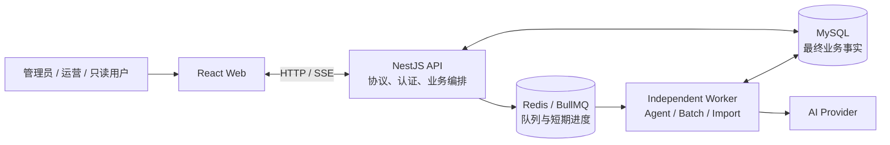

# 跨境电商 AI 运营助手：后端完整面试讲解手册

> 适用场景：校招后端、Node.js/NestJS、AI 应用后端、全栈岗位。
>
> 事实基线：2026-08-15，融合工程 `apps/api`、`apps/worker`、`packages/shared` 和 Prisma/MySQL/Redis 配置。
>
> 核心口径：这不是一个“NestJS CRUD + 聊天接口”项目，而是一个有认证授权、租户隔离、业务状态机、AI 人工审核、受控 Agent、RAG 引用、异步任务和可观测性的模块化单体。

## 1. 一句话和三分钟版本

### 1.1 一句话介绍

这是一个基于 NestJS、Prisma、MySQL、Redis 和 BullMQ 实现的跨境电商 AI 运营后端：用户在服务端 RBAC 和商家隔离下管理商品、SKU、订单和店铺，AI 只能查询业务数据或生成草稿，正式写回必须经过人工确认、版本校验、事务和审计。

### 1.2 三分钟介绍

项目最初是两个相互独立的原型：一个电商管理后台和一个 AI 对话页面。它们都缺少真实的服务端业务边界。我在新的 `apps/api` 中采用模块化单体，先把认证、权限、商家隔离、事务和审计做成统一基础设施，再将 AI 能力接入现有业务 Service。

第一，认证采用短期 Access Token 和 HttpOnly Refresh Token。Refresh Token 在数据库中只保存哈希，每次刷新都轮换，重放旧 Token 会撤销整个 Token Family。Access Token 验证后会重新读取用户状态、角色和商家范围，因此停用账号不需等待 JWT 过期。

第二，业务数据以 Merchant 作为服务端隔离边界。Controller 只处理协议和 DTO，Service 负责权限、状态机、事务和并发控制，Prisma 负责数据访问。商品普通编辑、AI 草稿写回和订单状态变更都使用版本条件更新，避免并发覆盖。关键写操作在同一 MySQL 事务中保存业务结果和审计日志。

第三，AI 不是数据库权限主体。统一 `AiProvider` 封装流式对话、结构化商品优化、会话摘要和 Tool Calling。模型返回的商品内容先通过 Zod Schema 校验并保存为草稿，正式商品必须由用户确认后再经 Product Service 写回。

第四，Agent 是受控 ReAct 循环，不是自主执行平台。模型只能调用六个白名单工具，工具参数在服务端再次校验，工具只调用业务 Service，不能直接操作 Prisma。唯一的写工具也只能创建待确认草稿，而且需要用户对本次运行明确授权。

第五，批量 AI 和结构化导入使用 BullMQ 和独立 Worker。Redis 只负责调度，MySQL 保存最终状态。系统通过幂等键、确定性 Job ID、数据库条件领取、尝试号 fencing 和定时对账来吸收重复投递与 Worker 异常中断。

最后，项目有真实 MySQL/Redis 集成测试、237 项自动化测试、Docker Compose、Prisma Migration、健康检查、Prometheus 指标和 GitHub Actions，用工程证据证明核心链路不只能在 Mock 环境运行。

## 2. 系统架构与边界



### 2.1 各层职责

| 层次              | 职责                                                | 不应承担的职责                       |
| ----------------- | --------------------------------------------------- | ------------------------------------ |
| Controller        | 路由、DTO、HTTP/SSE、响应头                         | 长业务流程、直接 Prisma 查询         |
| Guard/Decorator   | 全局认证、角色、限流                                | 商家内的具体业务规则                 |
| Service           | 商家隔离、状态机、事务、幂等、审计                  | HTTP 细节、前端状态                  |
| Repository/Prisma | 数据访问、复合条件更新、关系约束                    | 模型决策、越过 Service 的 Agent 工具 |
| AI Provider       | 模型适配、流式输出、Structured Output、Tool Calling | 权限、业务写回决策                   |
| Worker            | 批量任务、结构化导入、Agent 执行                    | 把 Redis 状态当作最终业务事实        |
| `packages/shared` | 稳定共享类型、Zod Schema、环境变量 Schema           | 大量只被一端使用的业务实现           |

### 2.2 为什么是模块化单体

当前是个人可完成、面试官可快速运行的校招项目。商品写回、版本记录和审计日志需要本地事务，模块化单体可以直接保持一致性。Worker 已经提供了独立进程边界，足以展示同步请求与异步任务的拆分。

没有选择：

- 微服务和分布式事务；
- Kafka 和通用事件平台；
- Kubernetes 和服务网格；
- 通用多 Agent 编排框架；
- 自研向量数据库或工作流引擎。

这些技术并不是不好，而是当前没有真实规模、团队和部署边界支撑它们。

## 3. 技术栈与取舍

| 技术                  | 项目用途                                   | 面试取舍                                         |
| --------------------- | ------------------------------------------ | ------------------------------------------------ |
| Node.js + TypeScript  | API、Worker、共享类型                      | 前后端语言统一，但权限与运行时校验仍由服务端负责 |
| NestJS                | 模块、DI、Guard、Pipe、Filter              | 边界结构明确，适合业务型后台                     |
| Prisma                | Schema、Migration、事务、类型化查询        | 降低数据访问样板代码，并发不变量仍显式写入 WHERE |
| MySQL 8.4             | 业务数据、任务终态、审计、幂等             | 作为最终事实源，不用 Redis 代替业务持久化        |
| Redis + BullMQ        | 异步调度、重试、延迟和队列进度             | 适合当前 Node.js 生态，不为校招项目引入 Kafka    |
| OpenAI-compatible SDK | 流式对话、JSON 输出、Tool Calling          | Provider 接口解耦具体模型，测试默认使用 Mock     |
| Zod + class-validator | 共享 AI Schema 与 HTTP DTO                 | HTTP 边界和模型输出都做运行时校验                |
| Vitest + Supertest    | 纯函数、Service、Controller 和真实集成测试 | 不用单一覆盖率代替核心业务不变量                 |
| Prometheus client     | HTTP、Agent、Token、队列指标               | 使用低基数标签，不把 userId/requestId 当标签     |

## 4. 后端目录与模块边界

```text
apps/api/
├── prisma/
│   ├── schema.prisma       数据模型
│   └── migrations/         版本化迁移
└── src/
    ├── auth/               JWT、Refresh Token、RBAC
    ├── users/              用户生命周期、角色、商家范围
    ├── commerce/           Merchant、Store、Product、SKU、Order、Dashboard
    ├── ai/                 Provider、会话、Agent、RAG、商品优化
    ├── batch/              批量 AI 任务
    ├── imports/            CSV/XLSX 导入与异步写入
    ├── reliability/        持久化任务对账恢复
    ├── observability/      Request ID、日志、异常、指标
    ├── health/             liveness/readiness
    ├── security/           限流
    ├── integration/        真实 MySQL/Redis 集成测试
    ├── app.module.ts
    ├── app.setup.ts
    ├── main.ts
    └── batch-worker.ts

apps/worker/src/main.ts             独立 Worker 进程入口
packages/shared/src/               前后端共享类型与 Schema
```

## 5. 从启动到响应的完整请求链路

### 步骤 1：校验环境变量

API 启动前通过共享 Zod Schema 校验：

- `DATABASE_URL`；
- `REDIS_URL`；
- 最少 32 位的 `JWT_ACCESS_SECRET`；
- `WEB_ORIGIN`；
- AI Provider 的 Key、Base URL、Model 和 Timeout；
- JSON Body 大小、Swagger 开关等。

配置错误应在进程启动阶段尽早失败，而不是等第一个用户请求才暴露。

### 步骤 2：建立 NestJS 全局基线

`configureApiApplication` 统一安装：

1. CORS 允许指定 Web Origin 并开启 Credentials；
2. Helmet 安全响应头；
3. 显式 JSON/URL Encoded Body 大小限制；
4. Cookie Parser；
5. `ValidationPipe` 的 transform、whitelist 和 `forbidNonWhitelisted`；
6. 统一 `HttpExceptionFilter`；
7. Graceful Shutdown Hooks；
8. 开发环境下的 Swagger。

### 步骤 3：分配 Request ID

请求可以传入符合安全格式的 `X-Request-Id`，否则 API 生成 UUID。响应回传同一 ID，请求完成时记录结构化日志和 HTTP 指标。

日志只记录 method、规范化 route、status 和 duration，不记录 Authorization、Cookie、请求正文或敏感查询参数。

### 步骤 4：全局 Guard 链

```text
RateLimitGuard
      ↓
AccessTokenGuard
      ↓
RolesGuard
      ↓
Controller
```

- `@Public()` 仅跳过鉴权；
- 其他接口必须提供 Bearer Access Token；
- `@Roles()` 在 Controller 层指定角色；
- Service 仍然会校验 merchantId 和具体业务状态。

### 步骤 5：DTO 转换与严格校验

查询字符串中的 page/pageSize 会显式转为 number。未声明字段直接返回 400，避免客户端传入意外字段被 Prisma 透传。

### 步骤 6：Service 执行业务不变量

Service 按以下顺序执行：

1. 商家/店铺访问权；
2. 当前实体是否存在；
3. 角色是否允许该业务操作；
4. 状态转换、版本或幂等条件；
5. 在同一事务中保存业务结果、版本/时间线和审计。

### 步骤 7：统一错误契约

```json
{
  "statusCode": 409,
  "code": "CONFLICT",
  "message": "商品已被修改，请刷新后重试",
  "requestId": "interview-demo-001",
  "timestamp": "2026-08-15T00:00:00.000Z",
  "path": "/api/merchants/.../products/..."
}
```

未知 5xx 异常对客户端只返回安全文案，完整异常类型只记录在服务端，避免泄露 SQL、文件路径或内部栈。

## 6. 认证、Refresh Token 与 RBAC

### 6.1 登录链路

```text
邮箱 + 密码
   ↓ 邮箱归一化
查询当前用户
   ↓ bcrypt 验证
记录 LoginLog
   ↓
签发短期 Access Token
   +
生成 48 字节随机 Refresh Token
   ↓
数据库只保存 SHA-256 Hash
```

失败登录不区分“邮箱不存在”和“密码错误”，减少账号枚举。登录按 IP + 归一化邮箱限流。

### 6.2 Refresh Token 轮换

每次 Refresh 执行：

1. 对 Cookie 中的 Token 做 SHA-256；
2. 在事务中查询当前 Token 及用户；
3. 校验是否过期、撤销、用户停用或软删除；
4. 通过 `revokedAt IS NULL` 条件消费旧 Token；
5. 创建同 Family 下的新 Token；
6. 如果旧 Token 已被消费后再次使用，撤销家族内剩余 Token。

这里使用数据库条件更新处理并发 Refresh，而不是先查后无条件更新。

### 6.3 Access Token 为什么还要查数据库

JWT 只用来确认签发者和 userId。Guard 验签后会重新加载：

- 用户是否存在；
- 是否处于 ACTIVE；
- 当前角色；
- 当前可访问商家。

取舍是每个鉴权请求多一次数据库读取，但对当前校招作品的数据规模可接受，并且换来停用账号和调整权限的即时生效。

### 6.4 用户管理保护

管理员可以创建、更新、停用和软删除用户，但服务端会阻止：

- 停用当前登录用户；
- 移除自己的 admin 角色；
- 删除自己；
- 移除系统最后一个启用管理员；
- 分配不存在的角色或商家；
- 邮箱重复。

密码修改或账号停用后，服务端会在同一事务中撤销该用户未失效的 Refresh Token。

## 7. Merchant、Store 与多租户隔离

### 7.1 三个概念

- `Merchant`：权限和数据隔离边界；
- `Store`：一个具体平台、市场、币种、语言和时区下的店铺；
- `ProductListing`：主商品在某个店铺下的刊登信息。

一个 Merchant 可以有 Amazon 美国店和 Shopee 巴西店，一个 Product 可以在多个 Store 中有不同语言、标题、价格和刊登状态。

### 7.2 隔离怎么落地

不只在 Controller 中接收 `merchantId`，而是：

1. `MerchantAccessService` 先校验当前用户的商家范围；
2. 列表查询的 `where` 固定带 `merchantId`；
3. 单记录查询使用 `id + merchantId`；
4. Store、ProductListing、Order 关系使用复合商家外键；
5. Agent Tool 也必须传入当前 merchantId/storeId；
6. RAG 在排序前就过滤全局和当前商家文档。

前端的商家选择器只是上下文体验，不是权限证明。

## 8. Prisma 数据模型怎么讲

### 8.1 认证与权限

- `User`：账号、密码 Hash、状态、软删除时间；
- `Role` / `UserRole`：多角色关系；
- `MerchantUser`：用户可访问的商家；
- `RefreshToken`：哈希、Family、过期和撤销；
- `LoginLog`：登录成功/失败记录。

### 8.2 电商核心

- `Merchant`、`Store`、`ProductListing`；
- `Product`、`Sku`；
- `Order`、`OrderItem`、`OrderEvent`；
- `OrderSavedView`；
- `OrderBulkOperation` / `OrderBulkItem`；
- `AuditLog`。

### 8.3 AI 与知识

- `AiSession`、`AiMessage`、`AiConversationSummary`；
- `AiMessageLink`、`AiSessionShare`；
- `ProductOptimization`、`ProductVersion`；
- `AgentRun`、`AgentToolCall`、`AgentRunFeedback`；
- `RuleDocument`、`RuleChunk`。

### 8.4 异步任务

- `BatchOptimizationTask` / `BatchOptimizationItem`；
- `ImportJob` / `ImportItem`。

任务主表保存总数、成功、失败、取消和终态；任务项保存每个商品/行的尝试次数、错误和关联草稿。这使系统能展示部分失败，而不只有一个模糊的“批次失败”。

## 9. 商品、SKU 和库存

### 9.1 商品查询

商品列表支持：

- 商家隔离；
- 店铺刊登范围；
- 状态；
- 商品编码、标题和 SKU 编码关键词；
- 分页和更新时间排序。

列表数据和 count 在同一 Prisma Transaction 中读取，保持分页口径尽可能一致。

### 9.2 普通编辑的乐观锁

客户端编辑时携带最后读到的 `expectedVersion`：

```ts
const changed = await transaction.product.updateMany({
  where: {
    id: productId,
    merchantId,
    version: expectedVersion,
  },
  data: {
    ...changes,
    version: { increment: 1 },
  },
})

if (changed.count !== 1) {
  throw new ConflictException('商品已被修改，请刷新后重试')
}
```

要点是版本必须写在 `UPDATE WHERE` 中。如果只是先查版本、再无条件更新，两个并发事务仍然可以都通过旧版本检查。

### 9.3 SKU 和库存

SKU 写操作会校验：

- 所属 Product 是否属于当前商家；
- SKU Code 在当前商家是否唯一；
- 价格和币种格式；
- 调整后库存是否为负数。

库存调整不是直接覆盖，而是读取当前库存后，用当前值作为条件更新。这可以防止两次并发扣减都基于同一个旧值。

## 10. 订单状态机和批量操作

### 10.1 为什么不做任意 PATCH

订单不能从任意状态跳到任意状态。服务端定义显式转换表：

```text
PENDING    → CONFIRMED / CANCELLED
CONFIRMED  → SHIPPED / CANCELLED
SHIPPED    → DELIVERED
DELIVERED  → COMPLETED / REFUNDING
COMPLETED  → REFUNDING
REFUNDING  → REFUNDED
```

`COMPLETED`、`REFUNDING`、`REFUNDED` 等高风险转换只允许 admin。

### 10.2 状态转换事务

一次状态更新会在同一事务中：

1. 读取 `id + merchantId` 下的当前订单；
2. 校验状态机和角色；
3. 使用 `id + merchantId + version + currentStatus` 条件更新；
4. 同步更新支付/履约/退款维度；
5. 写入 `OrderEvent`；
6. 写入 `AuditLog`；
7. 返回更新后的订单详情。

如果条件更新数量不是 1，返回 409，而不是静默覆盖其他操作。

### 10.3 批量操作

订单批量操作不把全部订单包成一个“全或无”事务，而是：

- 先使用 `merchantId + idempotencyKey` 建立批量操作记录；
- 使用 Payload Hash 阻止相同幂等键被用于不同参数；
- 每个订单单独执行同一个 `transition` Service；
- 返回每个订单的成功、失败和错误原因；
- 最终状态为 COMPLETED 或 PARTIAL_FAILED。

这种设计符合运营后台的产品需求：一条订单状态不合法，不应抹掉其他合法操作。

## 11. AI 会话底座

### 11.1 会话与消息持久化

`AiSession` 保存商家、用户、标题、分组、置顶、归档和当前活动分支。`AiMessage` 保存 parentId、childrenIds、编辑修订和收藏状态。

模型上下文不是把整个会话列表都发给模型，而是沿当前活动叶子的 parentId 追溯血缘。用户编辑消息后被放弃的分支不会混入当前上下文。

### 11.2 Token 预算和摘要

当历史消息超出预算时，系统使用：

```text
历史结构化摘要
    +
摘要锚点后的最近原文
    +
当前用户消息
```

摘要本身使用 Schema 校验，并保存覆盖到哪条消息、原始消息数量和 Token 用量。如果摘要失败，系统降级为最近原文，不让整个会话不可用。

### 11.3 流式输出和取消

AI Chat 通过 Provider 将 token chunk 增量回传。停止生成使用 AbortSignal，已生成部分仍可保存。

Agent 流程则不把长运行绑定到 SSE 连接：

- API 创建 `AgentRun` 后立即返回 runId；
- Worker 在后台继续执行；
- SSE 只用于展示持久化进度；
- SSE 断开不代表取消 Worker；
- 客户端可以根据 runId 重新查询最终事实。

## 12. AI Provider 与 Structured Output

### 12.1 Provider 接口

统一 Provider 定义以下能力：

- `chat`：流式对话；
- `generateTitle`：会话标题；
- `summarizeConversation`：长上下文摘要；
- `optimizeProduct`：结构化商品草稿；
- `runAgentStep`：受控 Agent 单步决策。

默认存在两个实现：

- `MockAiProvider`：本地演示和自动化测试，无需密钥和费用；
- `OpenAiProvider`：适配 OpenAI-compatible Chat Completions API。

项目没有一开始就做复杂多供应商路由，因为当前没有真实的多供应商 SLA 和成本调度需求。

### 12.2 商品优化 Schema

```ts
interface ProductOptimizationDraft {
  title: string
  description: string
  sellingPoints: string[]
  complianceRisks: string[]
  suggestions: string[]
  language: string
  confidence: number
}
```

模型 JSON 输出会经过共享 Zod Schema 校验。如果第一次不合法，进行一次受限结构修复；修复后仍不合法则记录 `INVALID_OUTPUT`，不把不可信 JSON 当作业务结果。

### 12.3 AI 错误分类

模型错误会被归类为超时、限流、上游错误、非法输出、取消等稳定错误码。Worker 只对瞬时且可重试错误交给 BullMQ 重试，参数或 Schema 错误不做无意义重试。

## 13. 单商品 AI 优化与 Human-in-the-loop

### 13.1 完整链路

```text
运营人员发起优化
  ↓
校验 admin/operator + merchantId + productId
  ↓
读取商品当前内容和 version
  ↓
保存 GENERATING 记录和 sourceData
  ↓
Provider 返回结构化草稿
  ↓
Zod 校验 + 语言一致性校验
  ↓
保存 DRAFT + usage + provider/model/promptVersion
  ↓
用户人工确认
  ↓
Product Service 校验 baseProductVersion
  ↓
事务写回 Product + ProductVersion + Optimization + AuditLog
```

### 13.2 为什么正式写回必须走 Product Service

AI 不是权限主体，Provider 也不应知道 Prisma。正式写回必须复用商品 Service，这样才能统一保证：

- 用户权限；
- 商家隔离；
- 草稿状态；
- 商品版本；
- 事务原子性；
- 前后版本与审计。

### 13.3 重复确认和过期草稿

- 草稿已经 APPLIED 时，重复确认返回当前商品，不再写一次；
- 商品版本已与 `baseProductVersion` 不同时返回 409；
- REJECTED 或 ERROR 草稿不能应用；
- 正式商品不会因生成草稿而改变。

## 14. 受控 Agent Tool Calling

### 14.1 一次 Agent 运行

```text
POST /agent/run
  ↓
校验用户、商家、店铺、活跃运行数
  ↓
持久化 AgentRun(status=PLANNING)
  ↓
使用 runId 作为 BullMQ Job ID
  ↓
API 立即返回 runId
  ↓
Worker 从 MySQL 重建用户、角色、商家、店铺、会话上下文
  ↓
最多 4 步 ReAct / 6 次工具 / 16000 Token 软预算
  ↓
每个 Tool Call 立即持久化
  ↓
引用校验 + 最终答案
  ↓
完成状态与会话消息原子落库
```

### 14.2 六个白名单工具

| 工具                                | 能力             | 边界                                     |
| ----------------------------------- | ---------------- | ---------------------------------------- |
| `search_products`                   | 搜索商品         | 商家/店铺隔离，最多返回少量结果          |
| `get_inventory`                     | 查询 SKU 库存    | 不提供库存写工具                         |
| `get_order_status`                  | 查订单状态       | 裁剪邮箱、电话、收货地址等敏感信息       |
| `get_business_overview`             | 查经营聚合       | 复用 Dashboard Service，不由模型自己计算 |
| `search_platform_rules`             | 查平台规则       | 必须返回本次检索引用                     |
| `create_product_optimization_draft` | 创建商品优化草稿 | 显式授权 + 写角色 + 每次运行最多一次     |

### 14.3 模型不可信时怎么保护

1. 模型只看得到服务端当前提供的工具定义；
2. 工具名不在白名单时返回错误 Tool Result；
3. 参数用 Zod 重新校验；
4. 工具只能调用已有业务 Service；
5. 每个工具参数、结果或错误都审计；
6. 草稿授权是 `AgentRun.allowDraftCreation` 中的持久化事实，不靠 Prompt 关键词；
7. 服务端不向模型暴露正式写回工具；
8. 即使模型越权请求两次草稿，第二次也会被确定性策略拒绝。

### 14.4 取消与终态竞争

取消不只关闭前端 SSE，还会：

- 在 MySQL 中用条件更新将 PLANNING/RUNNING 改为 CANCELLED；
- 尝试移除尚未执行的 BullMQ Job；
- Worker 内的跨进程监控器定期检查取消事实并触发 AbortSignal；
- 完成和取消都使用非终态条件更新，最终只允许一个终态成功。

## 15. 规则 RAG

### 15.1 文档治理

规则文档保存：

- GLOBAL 或 MERCHANT 作用域；
- platform、market、category、language；
- version、effectiveFrom、effectiveTo；
- sourceUrl；
- supersedesDocumentId；
- contentHash；
- ACTIVE/ARCHIVED 状态。

新版本替代旧版本时，新文档创建和旧文档归档在同一事务内完成。相同作用域下内容指纹一致的有效文档会被拒绝。

### 15.2 确定性切分

- Markdown 标题作为 heading；
- 空行分隔段落；
- 过长段落按长度切分并保留少量 overlap；
- 每个 Chunk 保存顺序、标题、原文和可搜索词。

确定性切分的优点是容易测试、复现和比较调优前后差异。

### 15.3 检索过程

```text
用户问题
  ↓
商家权限
  ↓
ACTIVE + GLOBAL/当前商家
  ↓
platform / market / category / effective time 过滤
  ↓
中英文词法归一化
  ↓
BM25 风格词法分数 + 标题/短语权重 + coverage
  ↓
文档多样化后取 Top 3
  ↓
证据充分性判断
```

如果无候选、相关度低或候选超过 500 导致截断，系统会返回明确的机器可读拒答原因，不让模型根据不完整证据猜测。

### 15.4 引用校验

每个检索结果包含：

- 本次 Tool Call 内的引用编号；
- documentId / chunkId；
- 文档标题、平台、市场、版本和作用域；
- 原文摘录；
- 来源 URL；
- score 和 coverage。

Agent 最终答案只能使用本次工具真实返回的引用。伪造引用、缺少引用或工具已返回信息不足时，最终回答会安全降级。

### 15.5 评估口径

当前固定评估集包含 26 条正向问题和 12 条拒答问题，评估：

- Hit@1；
- Recall@3；
- MRR；
- 无答案拒答准确率。

当前 Recall@3 = 1.0 只表示固定小型回归集没有退化，不能声称“RAG 在真实生产中 100% 准确”。

## 16. BullMQ 批量任务

### 16.1 为什么不在 HTTP 中同步执行

一个批次可以包含多个模型调用。同步执行会导致：

- HTTP 超时；
- 用户断开后无法恢复；
- 无法展示逐项进度和失败原因；
- 一个商品失败拖垮整个批次；
- API 进程需要承担大量长连接任务。

因此 API 只创建 MySQL 任务和 BullMQ Job，Worker 独立执行。

### 16.2 幂等设计

| 层次        | 幂等方式                                               |
| ----------- | ------------------------------------------------------ |
| HTTP 创建   | `merchantId + idempotencyKey` 唯一约束                 |
| 参数防冲突  | 幂等键已存在时比较目标语言、商品集或 Payload Hash      |
| 队列投递    | 任务项 ID 作为 BullMQ Job ID                           |
| Worker 领取 | `status=PENDING AND attempts=oldAttempts` 条件更新     |
| 草稿产物    | `batchItemId` / `importItemId` / `agentRunId` 唯一关联 |
| 完成回写    | `status=PROCESSING AND attempts=currentAttempt`        |

### 16.3 尝试号作为 fencing token

Worker 领取任务时把 attempts 加一。之后完成或失败回写必须同时匹配这个 attempts：

```text
Worker A 领取：attempts = 1
    ↓ 进程异常卡住
对账器超时重置为 PENDING
    ↓
Worker B 领取：attempts = 2
    ↓
Worker A 晚到回写 attempts = 1 → 条件不匹配，不能覆盖
Worker B 回写 attempts = 2 → 成功
```

这不是全局分布式锁，而是基于业务行版本的轻量 fencing。

### 16.4 重试和取消

- 默认最多 3 次尝试；
- 非最终失败重置为 PENDING；
- 最终失败写入 FAILED 和错误摘要；
- 用户取消只立即取消未执行项；
- 正在执行的项安全收尾，不强制中断数据库事务；
- 主任务根据 completed + failed + cancelled 计算终态。

## 17. 结构化导入

### 17.1 导入不是通用 ETL

系统只支持 CSV/XLSX 的商品和 SKU 结构化导入，不支持把 Markdown/TXT 直接写入商品，也不会根据文件“自动猜测并写入”。

### 17.2 三阶段流程

1. **Analyze**：读取工作表、表头和样例，不写业务数据；
2. **Preview**：应用字段映射，进行行级校验和当前商家冲突检查，仍不写数据；
3. **Create Job**：用户确认后创建 ImportJob/Item，有效行进入 BullMQ。

### 17.3 文件安全限制

- 最大 5 MB；
- 最多 10 个工作表；
- 最多 1000 数据行；
- 最多 80 列；
- 表头行必须在 1—20；
- 只接受 `.csv` 和 `.xlsx`；
- 公式行直接标记无效；
- 不执行宏或外部链接；
- 价格、币种、库存、语言、编码和长度都做确定性校验。

### 17.4 业务冲突预览

预览会检查：

- 同编码 DRAFT 商品：警告将覆盖草稿字段；
- 同编码正式商品：拒绝覆盖；
- SKU 已属于其他商品：拒绝；
- 文件内 SKU 编码重复：拒绝；
- 同一商品编码使用不同标题：拒绝。

### 17.5 Worker 不绕过业务 Service

导入 Worker 依次调用 Product Service、SKU Service 和可选 ProductOptimization Service。即使数据来自已经预览的文件，Worker 也不直接通过 Prisma 写商品，因为真正的业务约束应只保留一份。

## 18. MySQL 与 Redis 的一致性

### 18.1 为什么不声称 exactly-once

MySQL 提交和 Redis 入队不在同一个本地事务中：

```text
MySQL 创建任务成功
   ↓
进程在入队前崩溃
   ↓
数据库有 PENDING，Redis 无 Job
```

如果直接宣称 exactly-once，就忽略了这个事实。当前系统采用：

```text
at-least-once 投递
    +
业务幂等
    +
数据库条件领取
    +
唯一产物关联
    +
定时对账补投
```

### 18.2 对账恢复

Worker 启动时和之后每 30 秒：

- 扫描超过安全窗口的 PENDING 批量项；
- 扫描 PENDING 导入项；
- 扫描 PLANNING AgentRun；
- 将超过 5 分钟的 PROCESSING 批量/导入项安全重置为 PENDING；
- 按业务 ID 重新入队；
- 每次按固定上限扫描，避免一次拉取无界数据。

原 Worker 晚到的完成回写会因 attempts fencing 失败，不会覆盖新一次尝试。

### 18.3 Agent 孤儿运行

Agent Tool Call 执行完会持久化并刷新 AgentRun 的 updatedAt。超过上限时间仍处于 PLANNING/RUNNING 的运行会被标记为 FAILED，避免工作台永久展示运行中。

## 19. 事务、幂等、乐观锁和审计的区别

| 机制    | 解决的问题                           | 项目例子                                     |
| ------- | ------------------------------------ | -------------------------------------------- |
| 事务    | 一组数据库写入要么都成功、要么都失败 | 商品写回 + 版本 + 草稿状态 + 审计            |
| 幂等    | 相同请求/消息重放不产生重复业务结果  | 批量任务幂等键、任务项唯一草稿               |
| 乐观锁  | 两个并发修改不要静默覆盖             | Product version、Order version、SKU 当前库存 |
| Fencing | 旧执行者在新执行者之后返回时不能回写 | Batch/Import Item attempts                   |
| 状态机  | 防止业务实体非法跳转                 | Order、Optimization、AgentRun                |
| 审计    | 事后回答谁在什么时候改了什么         | AuditLog、OrderEvent、AgentToolCall          |

面试时不要把这些词混在一起。例如，事务不能自动解决重复 HTTP 请求，幂等也不能代替一个事务内的原子写入。

## 20. 可观测性和安全基线

### 20.1 Request ID 与日志

- 接收符合白名单格式的 `X-Request-Id`，否则生成 UUID；
- 响应回传同一 ID；
- 请求完成时记录结构化 JSON；
- Web 错误提示可带 Request ID；
- 未知 5xx 只在服务端记录异常名称。

Request ID 用于技术排障，AuditLog 用于业务行为追溯，两者不是同一个概念。

### 20.2 Liveness 和 Readiness

- `/api/health/live`：只说明 API 进程可以响应；
- `/api/health/ready`：并发检查 MySQL 和 Redis，每项有短超时；
- 依赖不可用时 readiness 返回 not_ready，不把进程存活误报为可接流量。

### 20.3 Prometheus 指标

当前输出：

- HTTP 请求总数；
- HTTP 5xx；
- HTTP 耗时 Histogram；
- Agent 各状态数量；
- Agent 持久化 Token 总用量；
- Agent/Batch/Import 队列 waiting/active/delayed/failed。

标签只使用 method、规范化 route、status、queue 和 state，不用 userId、merchantId、requestId 或实体 ID，避免高基数拖垮 Prometheus。

### 20.4 限流与长任务边界

- Login：IP + Email；
- Refresh：IP；
- AI Chat / Agent：已认证 userId；
- Agent 还有每用户同时活跃运行数上限；
- JSON Body 有显式大小限制；
- 文件上传有 Multer 和解析器双重限制。

当前限流 Bucket 保存在单 API 进程内存中，这与当前单实例部署匹配。

## 21. 测试和交付闭环

### 21.1 测试分层

| 层次                  | 验证内容                                                    |
| --------------------- | ----------------------------------------------------------- |
| 纯函数测试            | RAG 切分/排序、引用校验、Prompt、环境 Schema                |
| Service 测试          | 商家隔离、状态机、事务调用、幂等、并发条件、重试和取消      |
| Controller/Guard 测试 | 角色、DTO、SSE、错误响应                                    |
| 真实集成测试          | 编译后的 Nest App + 真实 MySQL + 真实 Redis + HTTP + BullMQ |
| Web E2E               | 用户可见核心旅程                                            |

### 21.2 真实集成测试验证什么

1. HTTP 登录、JWT 和 `/auth/me`；
2. 未知 DTO 字段的 400 错误契约与 Request ID；
3. viewer 写操作 403；
4. 跨商家访问 403；
5. 商品第一次版本更新成功、第二次过期版本 409；
6. 批量任务相同幂等键只产生一条 MySQL 主任务；
7. Redis 中真实存在对应 Job；
8. MySQL/Redis readiness；
9. Prometheus 指标响应。

### 21.3 当前验证结果

- API：39 个测试文件，156 项通过；
- Web：74 项通过；
- Worker：1 项通过；
- Shared：6 项通过；
- 总计：237 项自动化测试通过；
- Format、ESLint、TypeScript、i18n 检查通过；
- Shared、API、Worker、Web 生产构建通过；
- 真实 MySQL/Redis 集成测试通过。

### 21.4 CI 流程

GitHub Actions 启动 MySQL 8.4 和 Redis 7.4 Service，然后：

1. `npm ci`；
2. Prisma Migration Deploy；
3. 真实集成测试；
4. `npm run verify`；
5. `docker compose config`；
6. 分别构建 API、Worker、Web 镜像。

这能验证项目在全新检出、没有本地 Prisma Client 或 dist 缓存时仍可构建。

## 22. 八组 STAR 面试故事

### STAR 1：从两个原型建立真实后端

- **S**：原电商后台主要是 Vite Mock，AI 对话只有轻量 Express 代理和浏览器持久化。
- **T**：建立一个可运行、可测试、可部署的统一业务后端。
- **A**：采用 NestJS 模块化单体，以 Merchant 作为数据边界，用 Prisma/MySQL 建模，用 Redis/BullMQ 处理异步任务，AI 统一通过 Provider 和业务 Service 接入。
- **R**：形成从鉴权、商品、AI 草稿、人工确认到审计的完整链路，并可通过 Docker 和 CI 复现。

### STAR 2：服务端 RBAC 和商家隔离

- **S**：原型中角色主要用来隐藏前端菜单，无法防止伪造 HTTP 请求。
- **T**：让权限变成真正的服务端安全边界。
- **A**：使用全局 AccessTokenGuard + RolesGuard，Token 验证后重新读取用户权限，每个业务 Service 再用 MerchantAccessService 和 `id + merchantId` 条件查询。
- **R**：真实集成测试证明 viewer 写入和跨商家访问都被服务端拒绝。

### STAR 3：商品并发编辑覆盖

- **S**：商品表已经有 version，AI 草稿写回也使用版本，但普通人工编辑未携带期望版本。
- **T**：防止两名运营人员同时编辑时，后提交者静默覆盖先提交者。
- **A**：DTO 增加 `expectedVersion`，Web 提交当前版本，Service 使用 `id + merchantId + version` 条件更新并递增 version，匹配失败返回 409。
- **R**：单元测试和真实 MySQL 集成测试都证明过期编辑不会覆盖已提交数据。

### STAR 4：AI 写操作的安全边界

- **S**：模型输出不稳定，也不能作为权限主体，直接写商品会带来越权和错误内容风险。
- **T**：让 AI 参与真实业务，同时保证正式数据可控和可追溯。
- **A**：模型只生成 Zod 校验后的 ProductOptimizationDraft；草稿保存原商品版本；用户确认后由 Product Service 执行权限、版本、事务、版本快照和审计。
- **R**：系统可以演示“生成草稿时正式商品不变”，过期草稿返回 409，重复确认不重复写入。

### STAR 5：从聊天升级为受控业务 Agent

- **S**：普通聊天只能输出文字，无法可靠地查询实时库存、订单和经营数据。
- **T**：让 AI 能够使用真实业务能力，但不绕过权限和 Service。
- **A**：实现受控 ReAct 循环、六个白名单工具、Zod 参数校验、工具逐次落库、最大步数/调用数/Token 预算，写工具只生成草稿并要求持久化明确授权。
- **R**：即使模型伪造工具名、非法参数或越权写请求，服务端也能确定性拒绝并留痕。

### STAR 6：RAG 可引用与可拒答

- **S**：平台规则类问题风险高，模型凭记忆回答容易编造，不同商家和市场的规则也不同。
- **T**：建立有权限、有适用范围、有原文引用、信息不足时会拒答的检索。
- **A**：在排序前过滤商家、平台、市场、品类和生效期，使用可解释 BM25 风格检索，返回文档/Chunk/原文/分数，最终再做引用校验。
- **R**：固定评估集 Recall@3 = 1.0，未知问题明确拒答；同时不将该结果夸大为生产 100% 准确。

### STAR 7：Worker 重复消费与异常恢复

- **S**：队列是 at-least-once，Worker 崩溃、重复投递和晚到回写可能让同一任务并发执行或永久卡住。
- **T**：不依赖“exactly-once”假设，保证重复投递可吸收、异常任务可恢复。
- **A**：Job ID 使用业务 ID，Worker 只领取 PENDING，attempts 作为 fencing token，产物有唯一关联，对账器重投遗漏 PENDING 并重置超时 PROCESSING。
- **R**：重复 Job 不能在正常 PROCESSING 时再次领取，旧尝试的晚到回写不能覆盖新尝试，队列丢失可从 MySQL 事实恢复。

### STAR 8：从“能跑”到“可证明”

- **S**：仅有 Mock 单元测试无法证明 Guard、ValidationPipe、Prisma Migration、MySQL 约束和 BullMQ 真实连通。
- **T**：建立可在全新环境重复的验证链。
- **A**：建立统一 verify，增加编译后 Nest 应用的真实 MySQL/Redis 集成脚本，CI 使用 Service Container，构建三个镜像，并提供 liveness、readiness、Request ID 和 Prometheus 指标。
- **R**：237 项测试、真实依赖集成回归和生产构建全部通过，项目可以用证据而不是口头声称说明可靠性。

## 23. 已确认并修正的真实后端缺陷

### P1：普通商品编辑会并发覆盖

- **原问题**：Product 有 version，但普通更新接口未使用客户端期望版本；
- **风险**：两个运营同时编辑时，后提交静默覆盖先提交；
- **修正**：`expectedVersion` + `UPDATE WHERE version` + version 递增 + 409；
- **证据**：Service 测试和真实 MySQL HTTP 集成测试。

### P1：Worker 可以重新领取 PROCESSING 任务

- **原问题**：Batch/Import Processor 的领取条件允许 PENDING 和 PROCESSING；
- **风险**：重复投递可与原 Worker 并发执行同一业务项；
- **修正**：只允许 PENDING 领取，超时 PROCESSING 由对账器单独重置；
- **证据**：批量和导入 Processor 都有重复投递不执行业务的测试。

### P1：旧 Worker 尝试可能晚到回写

- **原问题**：完成/失败回写只匹配 `status=PROCESSING`；
- **风险**：任务被恢复并交给新 Worker 后，旧 Worker 可能覆盖新尝试状态；
- **修正**：完成/失败同时匹配当前 attempts，把尝试号作为 fencing token；
- **证据**：Processor 测试显式断言完成回写的 attempts。

### P1：MySQL 已提交但 Redis 入队丢失

- **原问题**：MySQL 和 Redis 不在同一事务，进程可能在两步之间崩溃；
- **风险**：持久化任务永久保留在 PENDING/PLANNING；
- **修正**：启动时和周期对账，按业务 ID 补投；
- **证据**：TaskRecoveryService 测试覆盖 PENDING 补投和超时 PROCESSING 回收。

### P2：存活检查不能表示依赖可用

- **原问题**：单一 Health 响应容易将“进程没死”和“可以接受业务流量”混为一谈；
- **修正**：分离 `/health/live` 和 `/health/ready`，readiness 对 MySQL/Redis 有界超时检查。

### P2：未知 5xx 可能泄露内部错误

- **原问题**：各接口自行组装错误容易返回上游、SQL 或栈信息；
- **修正**：全局异常过滤器统一输出安全错误契约，未知 5xx 详情仅写服务端日志。

### P2：请求体和高成本接口缺少边界

- **原问题**：无界 JSON Body、登录爆破和频繁 Agent 调用会带来资源风险；
- **修正**：显式 Body Limit，登录/Refresh/AI/Agent 限流，Agent 活跃运行数上限。

## 24. 后续演进点：只在触发条件出现时实施

### P1：扩大真实模型评测

**当前状态**：Mock Provider 保证确定性回归，可选脚本可以测真实模型。

**触发条件**：准备将项目用于真实运营或比较多个模型。

**后续方案**：建立脱敏真实问题集，评估工具选择、参数、最终答案、引用忠实度、延迟和成本，不只看一个“准确率”。

### P1：分布式限流

**当前状态**：限流存储在单 API 实例内存中，符合当前部署。

**触发条件**：API 扩容为多副本，或需要所有实例共享精确配额。

**后续方案**：使用 Redis Store/Lua 原子计数，保留当前 Decorator 层的限流策略配置。

### P1：Worker 租约心跳

**当前状态**：单次 Provider 超时约 30 秒，5 分钟超时回收对当前任务有足够窗口。

**触发条件**：导入或 Agent 单项可能合法执行十几分钟。

**后续方案**：引入 leaseId、heartbeatAt 和按任务类型配置的超时，回写同时校验 leaseId。

### P2：RAG 混合检索

**当前状态**：小型规则库中词法检索可解释、可复现，固定评估集指标达标。

**触发条件**：候选 Chunk 经常超过 500，或独立评估显示同义改写召回不足。

**后续方案**：增加 Embedding 向量召回，与词法召回融合，再根据评估决定是否需要 rerank。

### P2：SSE 的多实例通知

**当前状态**：SSE 读取持久化快照，断线可用 runId 恢复，适合当前规模。

**触发条件**：API/Worker 多实例、大量并发 SSE 或数据库轮询成为明确瓶颈。

**后续方案**：使用 Redis Pub/Sub 或独立事件通道推送运行更新，MySQL 仍保留为断线恢复事实。

### P2：OpenTelemetry 跨边界 Trace

**当前状态**：已有 Request ID、结构化日志、Prometheus 指标和业务审计。

**触发条件**：真实运营中需要排查 HTTP → BullMQ → Worker → Provider 的跨进程延迟。

**后续方案**：接入 OpenTelemetry Trace，给 Job 传播 Trace Context，并建立队列积压、Provider 错误率和 Token 异常告警。

### P2：真实平台 Adapter

**当前状态**：项目只操作本地业务模型，没有伪装已经完成 Amazon/Shopee 生产接入。

**触发条件**：有真实测试店铺、OAuth 凭证和平台同步需求。

**后续方案**：在业务 Service 外围实现 Platform Adapter，异步同步外部状态，不让平台字段污染核心 Product/Order 模型。

## 25. 不应在面试中夸大的内容

- 不要说“生产级微服务”；当前是模块化单体 + 独立 Worker。
- 不要说“exactly-once”；当前是 at-least-once + 幂等 + 条件领取 + 对账。
- 不要说“RAG 准确率 100%”；只能说小型固定评估集当前 Recall@3 = 1.0。
- 不要说“AI 自动修改商品”；AI 生成草稿，人工确认后才写回。
- 不要说“接入了 Amazon/Shopee 生产店铺”；当前是本地 Store/Listing 业务模型。
- 不要说“完全防止模型幻觉”；可以说用 Schema、工具边界、引用校验和拒答降低风险。
- 不要说“限流已支持任意多实例”；当前是单实例内存限流。
- 不要说“通过了全部生产安全审计”；当前是作品级安全基线与依赖审计。

## 26. 高频追问与参考回答

### Q1：为什么不用微服务？

当前是个人校招项目，核心难点是业务权限、事务、AI 安全写回和异步任务可靠性。模块化单体能保留清晰边界和本地事务，同时降低部署复杂度。Worker 已经是独立进程，未来只有出现独立扩容、团队归属或部署边界时才需要继续拆分。

### Q2：JWT 里已经有角色，为什么每次还查数据库？

为了让停用账号、角色调整和商家范围变化立即生效。JWT 只作为签名后的 userId 凭证，当前权限仍以数据库为准。当前数据规模下这次查询可接受；如果未来成为瓶颈，可以使用短 TTL 权限缓存和用户权限版本。

### Q3：前端已经隐藏 viewer 按钮，为什么后端还要 RBAC？

浏览器不是信任边界，用户可以用 curl 或 DevTools 伪造请求。前端权限只是交互优化，最终决策必须在 Guard 和 Service。

### Q4：为什么不让 Agent 直接操作 Prisma？

否则同一个商品会有两套权限、验证、事务和审计实现。Agent Tool 调用现有 Product/Order/Dashboard Service，可以确保无论是人工界面还是 AI，都遵守同一业务不变量。

### Q5：为什么 AI 只能生成草稿？

模型输出不稳定，且模型不是已认证用户。草稿层可以保存结构化结果、用量、模型、Prompt 版本和原商品版本，由人工确认后再经服务端正式写回。

### Q6：怎么防止 AI 草稿覆盖用户刚改的商品？

生成草稿时保存 `baseProductVersion`，应用时在事务中读取当前 version，再使用 `WHERE version=baseProductVersion` 条件更新。版本不一致返回 409，要求用户重新生成。

### Q7：Tool Calling 怎么防止越权？

工具集由服务端根据角色和本次明确授权动态构造；工具名与参数再次校验；工具调用业务 Service；写工具只生成草稿；每个调用都持久化和审计。Prompt 只是辅助约束，确定性策略在代码中。

### Q8：为什么 RAG 不使用向量数据库？

当前文档小、规则关键词明确，BM25 风格词法检索容易解释、回归和部署。项目先把权限、生效时间、引用和拒答做对。只有独立评估证明同义语义召回不足时，才增加向量和混合检索。

### Q9：Redis 丢数据怎么办？

Redis 不是最终业务事实。BatchTask、ImportJob、AgentRun、任务项、错误和草稿关联都在 MySQL。对账器会扫描长时间未入队/未执行的持久化记录，按业务 ID 补投。

### Q10：如何避免重复消费？

不假设队列只投递一次。Job ID 使用任务项 ID，Worker 只能通过 PENDING + attempts 条件领取，草稿与任务项唯一关联，完成回写也匹配 attempts。所以重复消息可以被数据库状态机吸收。

### Q11：事务能解决 MySQL 和 Redis 一致性吗？

不能用一个 Prisma 本地事务同时覆盖 MySQL 和 Redis。当前选择 MySQL 为事实源，通过幂等重试和周期对账达成最终一致。如果未来业务量扩大，可以进一步使用 Transactional Outbox，但当前对账补偿已足够。

### Q12：为什么 Agent 用 SSE 而不是 WebSocket？

当前主要是服务端向浏览器单向推送运行快照，SSE 协议和运维都更简单。用户输入、反馈和取消仍使用普通 HTTP。最终事实在 MySQL，因此 SSE 断线也可用 runId 恢复。

### Q13：怎么证明后端不是 Mock？

展示 CI 和集成脚本：它先正式编译 Nest App，连接真实 MySQL/Redis，通过 HTTP 验证 JWT、Guard、DTO、商家隔离、乐观锁和 BullMQ Job，最后清理独立测试数据。

### Q14：项目当前最大的后端限制是什么？

当前是单 API 实例、小型规则库和演示级店铺数据，没有经过真实商家大流量、多实例限流和外部平台 API 变更的验证。但核心边界可以演进：限流可换 Redis Store，RAG 可换混合检索，平台接入可增加 Adapter，MySQL 仍是最终事实源。

## 27. 八分钟后端演示顺序

### 第 0—1 分钟：架构和边界

- 打开架构图；
- 说明 Web 不是安全边界；
- 说明 API 处理权限/事务，Worker 处理长任务，MySQL 是最终事实。

### 第 1—2 分钟：认证和隔离

- operator 登录；
- 展示 JWT + HttpOnly Refresh Cookie；
- viewer 调用写接口返回 403；
- 说明跨商家请求在 Service 被拒绝。

### 第 2—4 分钟：商品 AI 闭环

- 查商品当前 version；
- 生成西班牙语结构化草稿；
- 说明正式商品此时未变；
- 人工确认后展示 version 增长和 AuditLog；
- 解释过期草稿和普通并发编辑都返回 409。

### 第 4—6 分钟：Agent 和 RAG

- 用 Agent 查询库存；
- 展开 Tool Trace，说明工具参数经过 Zod 校验且只调用 Service；
- 先不授权草稿，再显式开启本次授权；
- 查询店铺平台规则，展示原文引用；
- 查询未知问题，展示信息不足拒答。

### 第 6—7 分钟：异步任务

- 创建批量优化或导入任务；
- 展示 MySQL Task/Item 和 Redis Job；
- 解释幂等键、Job ID、PENDING 领取、attempts fencing 和对账恢复；
- 强调是 at-least-once + 幂等，不是 exactly-once。

### 第 7—8 分钟：工程证据

- 打开 Swagger；
- 访问 liveness/readiness/metrics；
- 展示自定义 Request ID 在响应和日志中一致；
- 打开 CI，强调真实 MySQL/Redis 集成测试和 237 项自动化测试。

## 28. 建议的代码讲解路线

1. `apps/api/src/app.module.ts`：先看模块化单体组装；
2. `apps/api/src/app.setup.ts`：看全局 HTTP 安全和验证基线；
3. `apps/api/src/auth/guards/access-token.guard.ts`：看认证链；
4. `apps/api/src/auth/repositories/refresh-tokens.repository.ts`：看 Token 轮换与并发消费；
5. `apps/api/src/commerce/merchant-access.service.ts`：看商家隔离；
6. `apps/api/src/commerce/products.service.ts`：看事务、乐观锁、AI 草稿写回；
7. `apps/api/src/commerce/orders.service.ts`：看状态机、批量幂等和时间线；
8. `apps/api/src/ai/ai-provider.service.ts`：看 Provider 抽象和 Structured Output；
9. `apps/api/src/ai/agent.service.ts`：看受控 ReAct 循环；
10. `apps/api/src/ai/agent-tools.service.ts`：看工具只调用业务 Service；
11. `apps/api/src/ai/platform-rules.service.ts`：看 RAG 权限过滤和拒答；
12. `apps/api/src/batch/batch-processor.service.ts`：看条件领取和 attempts fencing；
13. `apps/api/src/reliability/task-recovery.service.ts`：看 MySQL/Redis 对账补偿；
14. `apps/api/src/integration/api.integration.ts`：看真实依赖验证证据；
15. `.github/workflows/ci.yml`：看全新环境下的交付闭环。

## 29. 最终总结话术

> 这个后端的核心不是接口数量，而是把 AI 安全地放进真实业务链路。底层用 JWT、RBAC 和 Merchant 做安全边界，商品、库存和订单用事务、状态机和乐观锁保证一致性。AI 只能查数据或生成草稿，Tool Calling 只调用业务 Service，正式写回必须人工确认并保留版本和审计。RAG 不只返回文字，还要有权限过滤、原文引用和信息不足拒答。批量任务则通过 BullMQ、MySQL 最终事实、幂等、fencing 和对账恢复处理 at-least-once。最后用真实 MySQL/Redis 集成测试、Docker、CI、健康检查和指标证明这些边界确实能运行。
