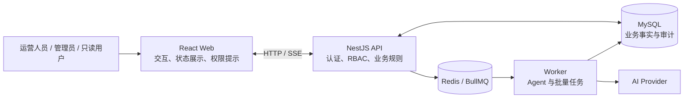

# 跨境电商 AI 运营助手：前端完整面试讲解手册

> 适用场景：校招前端、AI 应用前端、全栈偏前端岗位。
> 事实基线：2026-08-15，融合工程 `apps/web`。
> 核心口径：这不是“后台里放了一个聊天框”，而是一个有登录权限、商家/店铺上下文、复杂业务交互、AI 人工审核和工程验证闭环的 React 管理后台。

## 1. 一句话和三分钟版本

### 1.1 一句话介绍

这是一个基于 React、TypeScript、Vite 和 Ant Design 实现的跨境电商 AI 运营后台。前端围绕商家和店铺上下文连接商品、SKU、订单、经营看板、结构化导入与统一 Agent 会话；AI 默认只读取业务数据或生成草稿，正式商品必须经过人工确认后写回。

### 1.2 三分钟介绍

项目最初有两个独立原型：一个电商后台和一个 AI 聊天页面。我的前端工作不是直接拼接页面，而是在新的 `apps/web` 中重新建立统一应用边界。

第一，应用层使用 React Router、Redux、TanStack Query、i18next 和 Ant Design。Redux 只管理认证这类客户端全局状态，商品、订单、任务和工作台等服务端状态交给 TanStack Query。查询键带用户、商家、店铺和筛选条件，避免不同业务上下文串缓存。

第二，前端围绕“商家—店铺—业务资源”组织。用户登录后只能选择自己有权访问的商家和店铺；工作台、商品、订单和 Agent 请求都继承这个上下文。前端权限用于隐藏无效入口，真正的 RBAC 和商家隔离仍由服务端校验。

第三，核心演示链路是商品 AI 优化。运营人员从商品页面发起优化，前端展示原商品和结构化草稿的对比、卖点、风险提示、建议、置信度和 Token 用量。AI 不直接改正式商品，用户确认后才调用正式 Product Service 写回；拒绝、版本冲突和审计也有对应状态。

第四，AI 对话和 Agent 已经融合。所有输入进入统一 Agent，模型根据问题决定直接回答还是调用白名单业务工具。会话、消息树、运行状态、工具轨迹和取消操作都按 sessionId 隔离，切换会话不会终止后台任务，也不会让旧会话结果覆盖当前页面。SSE 负责实时体验，持久化查询负责断线恢复。

第五，工程上做了路由懒加载、基础依赖拆包、错误边界、并发 401 Single Flight、国际化检查、组件测试、集成测试和三条 Playwright 核心旅程。项目刻意没有引入微前端、通用多 Agent 平台或复杂设计系统，因为校招项目更重要的是核心链路完整、可运行、可测试和可解释。

## 2. 前端在整个系统中的位置



前端职责：

- 提供清晰的登录、导航、筛选、编辑、审核和错误恢复体验；
- 管理客户端交互状态和服务端缓存；
- 把商家、店铺、商品、订单和会话上下文准确传给 API；
- 展示 Agent 工具轨迹、结构化草稿和异步任务状态；
- 在交互层阻止明显无效操作，例如 viewer 不展示写入口；
- 对延迟、竞态、取消、空状态、失败和窄屏进行处理。

前端不承担的职责：

- 不作为最终权限边界；
- 不自行判断跨商家数据是否可访问；
- 不直接连接 Prisma 或数据库；
- 不允许模型在浏览器内直接执行写操作；
- 不把 Redis 队列状态当成最终业务事实。

## 3. 技术栈为什么这样选择

| 技术                        | 项目用途                         | 面试时的取舍说明                                     |
| --------------------------- | -------------------------------- | ---------------------------------------------------- |
| React 19                    | 页面、组件和 Hooks               | 适合复杂后台交互与可组合状态逻辑                     |
| TypeScript                  | DTO、页面状态、组件 Props        | 与共享业务类型配合，降低前后端字段漂移               |
| Vite                        | 开发与生产构建                   | 配置轻、构建快，适合单仓作品集                       |
| Ant Design 6                | 表格、表单、Drawer、Modal、反馈  | 管理后台重点是信息密度与状态一致性，不重复造基础控件 |
| Redux Toolkit               | 登录用户、Token、认证状态        | 只管理真正的客户端全局状态，不缓存所有服务端数据     |
| TanStack Query              | 商品、订单、任务、成果、看板缓存 | 处理查询键、失效、轮询、缓存生命周期和竞态隔离       |
| React Router                | 权限路由、嵌套路由、深链接       | 支持业务页面和结果详情的准确跳转                     |
| i18next                     | 中英文界面                       | 将界面语言与商品目标语言分离                         |
| react-markdown + remark-gfm | AI 回复                          | 安全渲染 Markdown/GFM，不开启原始 HTML               |
| Vitest + Testing Library    | 单元与组件测试                   | 验证状态、权限和用户交互，而不是测试实现细节         |
| Playwright                  | 三条核心 E2E                     | 只覆盖最高价值演示旅程，避免为了覆盖率扩大维护成本   |

没有选择微前端，是因为当前是个人校招作品集，没有多团队独立发布的真实需求。没有用 WebSocket 替换 SSE，是因为当前主要是服务端单向推送，SSE 更简单，并且已经有持久化 GET 恢复路径。

## 4. 目录与组件边界

```text
apps/web/src/
├── api/                 API 适配、错误解析、SSE
├── components/          跨页面业务组件
├── contexts/            商家/店铺业务上下文
├── hooks/               跨模块通用 Hook
├── i18n/                资源、语言初始化、格式化
├── layouts/             后台框架、菜单和上下文栏
├── pages/
│   ├── products/        商品/SKU/库存/审计
│   ├── orders/          订单筛选、视图、批量、详情
│   ├── ai-chat/         会话、消息、分叉、分享
│   ├── dashboard/       经营指标、待办、AI 入口
│   └── ...
├── queries/             Query Key、Query Hooks、Client
├── store/               Redux 认证状态
└── test/                测试环境与路由工具
```

模块划分遵循三条规则：

1. 页面入口负责组合，不堆积全部 UI 和副作用；
2. 有明确业务生命周期的逻辑进入 Hook；
3. 可独立描述和测试的视觉区域拆成组件，样式与组件共置。

订单页是最完整的例子：页面组合 `useOrderList`、`useOrderSavedViews`、`useOrderDetail`、`useOrderBulkActions`，再组合筛选卡、保存视图栏、批量栏、表格、详情 Drawer 和时间线。

## 5. 从启动到页面展示的完整步骤

### 步骤 1：挂载全局 Provider

应用启动后依次挂载：

1. Ant Design `ConfigProvider`：主题 Token 与组件样式；
2. Redux Provider：认证状态；
3. TanStack Query Provider：服务端缓存；
4. BrowserRouter：路由。

Ant Design 主题集中定义主色、背景、边框、圆角、表格和表单状态，避免页面各自维护视觉常量。

### 步骤 2：恢复登录会话

`App` 首次渲染派发 `restoreSession`：

- 浏览器通过 HttpOnly Refresh Cookie 请求新会话；
- 成功后 Redux 保存 Access Token 和用户；
- 失败则进入 anonymous；
- 状态为 checking 时展示独立加载页，避免登录页和后台闪烁。

### 步骤 3：路由与角色保护

路由分两层：

- `AuthenticatedRoute`：未登录跳转登录页，并记录原路径；
- `RoleRoute`：根据 `admin/operator/viewer` 决定是否进入页面，否则跳转 403。

典型边界：

- 商品与订单：viewer 可查看；
- AI 会话、成果、质量、批量、导入、店铺：admin/operator；
- 商家、规则知识库、用户管理：admin。

这里必须主动说明：前端路由只改善体验，服务端仍会检查 JWT、角色和 merchantId。

### 步骤 4：加载商家与店铺上下文

登录后 `BusinessContextProvider` 加载当前用户可访问商家，再加载当前商家的店铺：

```text
Access Token
   ↓
可访问 Merchant 列表
   ↓
当前 Merchant
   ↓
该 Merchant 下 Store 列表
   ↓
当前 Store
```

选择结果保存在 localStorage。切换商家会清理原店铺选择；如果保存的商家或店铺已经无权访问，则自动回退到第一个合法选项。

### 步骤 5：进入懒加载业务路由

AppLayout 和全部页面通过 `React.lazy` 加载，`Suspense` 使用统一 RouteLoading。路由异常由 Route Error Boundary 捕获，提供：

- 重试当前页面；
- 返回工作台；
- 路由变化后解除旧错误状态；
- 生产环境不显示堆栈。

## 6. 认证与请求层

### 6.1 Redux 只保存认证状态

认证 Slice 只包含：

- `checking/authenticated/anonymous`；
- Access Token；
- 当前用户；
- 登录错误。

没有把商品、订单和会话列表都塞进 Redux，因为这些数据有明确的服务端所有权、缓存时间和请求参数。

### 6.2 并发 401 Single Flight

Access Token 过期时可能有多个接口同时返回 401。如果每个请求都刷新一次，会出现 Refresh Token 轮换冲突。

实现方式：

```text
请求 A 401 ─┐
请求 B 401 ─┼─► 共用 refreshPromise ─► 新 Access Token ─► 各自重放一次
请求 C 401 ─┘
```

关键限制：

- 同一时刻只有一个 Refresh 请求；
- 原请求最多重放一次；
- 第二次仍 401 时退出登录；
- 登录、刷新和退出接口本身不进入恢复循环；
- API 错误附带服务端 Request ID，便于排查。

### 6.3 普通 HTTP 与流式请求分开

普通 JSON API 统一通过 `apiRequest<T>`；文件上传、下载和 SSE 因 Content-Type、Response Body 或流读取不同，保留专门适配函数，但共用鉴权和错误解析口径。

## 7. 状态管理：为什么是 Redux + Query + Local State

### 7.1 三类状态

| 状态类型       | 例子                     | 归属            |
| -------------- | ------------------------ | --------------- |
| 客户端全局状态 | 登录用户、Token          | Redux           |
| 服务端状态     | 商品、订单、任务、看板   | TanStack Query  |
| 页面交互状态   | Modal 开关、表单、选中行 | 组件 State/Hook |

### 7.2 Query Key 设计

查询键包含真正影响结果的全部维度：

```text
products + merchantId + storeId + page + keyword + status
orders + merchantId + storeId + filters + sort + page
dashboard + merchantId + storeId + days
agent-run + merchantId + runId
```

这样旧请求完成时只会写入自己的缓存键，不会覆盖新商家或新筛选的页面。

### 7.3 为什么有些分页使用 keepPreviousData

商品和订单翻页时保留上一页数据并展示 fetching 状态，可以减少表格闪烁；工作台切换 7/14/30 天时不保留旧数据，因为新周期标题搭配旧指标会造成业务误读。

### 7.4 精确失效与回填

- 商品/SKU 写操作：失效当前商家的商品根查询；
- 创建任务：直接写入任务详情缓存，再失效任务列表；
- 取消任务：回填详情终态，再刷新列表；
- 店铺修改：只失效当前商家的店铺查询。

### 7.5 手写异步请求的竞态治理

不适合立即迁移 Query 的局部读取使用轻量请求令牌：

1. 发请求时生成递增 ID；
2. 新请求开始或组件关闭时使旧 ID 失效；
3. 只有最新 ID 可以提交 data/error/loading；
4. 组件卸载自动失效。

该策略用于订单详情、保存视图、店铺刊登、规则列表/详情/检索、AI 会话和分享等场景。

## 8. 运营工作台怎么做

### 8.1 数据不是前端拼 Mock

工作台通过一个聚合接口获取：

- 当前周期和上一周期；
- 销售额、订单量、客单价、退款；
- 订单趋势、状态分布；
- 热销商品、低库存；
- 待处理订单、待审核草稿、失败任务；
- 运行中 Agent、批量任务和近期成果。

前端负责选择周期、商家和店铺，服务端负责统一统计口径。

### 8.2 为什么不在前端算经营指标

- 前端只有当前分页数据，无法覆盖全量订单；
- 金额、退款、取消订单排除规则需要单一事实来源；
- 商家、店铺和时区过滤必须由服务端保证；
- 同一聚合 Service 还能被 Agent 经营工具复用。

### 8.3 工作台与统一 AI 入口

快捷问题只负责把当前商家、店铺和时间范围转成预填内容，然后跳转统一 AI 助手，不自动发送。这样用户仍能在真正执行前修改问题，并且不会在工作台再维护第二套 Agent UI。

viewer 看得到经营数据，但看不到无法使用的 AI、草稿、批量任务和成果中心入口。

## 9. 商品、SKU 与 AI 人工审核链路

### 9.1 商品与 SKU

商品页面支持：

- 商家/店铺过滤、分页、关键词和状态；
- 商品创建与编辑；
- SKU 创建、编辑、停用；
- 原子库存调整；
- 审计记录；
- AI 优化入口。

写操作完成后失效商品查询，服务端继续校验权限、商家范围、库存下限和版本。

### 9.2 AI 优化 Drawer

用户选择商品后打开 Drawer：

1. 根据 productId 加载已有草稿；
2. 选择 `en-US/es-ES/pt-BR`；
3. 创建结构化优化任务；
4. 展示生成阶段；
5. 对比原商品与草稿；
6. 展示风险、建议、置信度和 Token；
7. 用户拒绝或确认写回。

Drawer 使用 productId 绑定加载结果，切换商品后旧请求不能覆盖新商品。

### 9.3 Human-in-the-loop

```text
正式商品
   ↓ 生成
AI 草稿（DRAFT）
   ├─ 拒绝 → REJECTED，不改商品
   └─ 人工确认
          ↓
       Product Service
          ↓
   正式商品 + 前后版本 + 审计
```

面试时应强调：`complianceRisks` 是模型根据商品文本给出的风险提示；只有带可验证规则引用的 Agent 回答才称为 RAG 合规结论。

## 10. 订单运营页面

### 10.1 查询与保存视图

订单支持关键词、生命周期、支付、履约、退款、时间、金额、店铺、排序和分页。用户可将当前筛选、排序、列配置和店铺保存为视图。

切换商家时，保存视图按 merchantId 隔离；旧商家请求即使迟到也不能覆盖当前列表。

### 10.2 批量操作

前端选择订单和动作，为每次操作生成 `crypto.randomUUID()` 幂等键。服务端逐单检查权限和状态机，所以返回结果允许部分成功、部分失败；前端用结果 Modal 展示每一项，而不是只弹一个“成功”。

### 10.3 详情与时间线

订单 Drawer 展示商品、客户脱敏信息、金额、物流和状态事件，并可从订单上下文发起只读 Agent。详情请求使用最新请求令牌，连续打开 A/B 订单时，A 的迟到结果不会覆盖 B。

## 11. 统一 AI 会话与 Agent 前端

### 11.1 页面组合

AI 页面入口主要组合三个 Hook：

- `useAiConversations`：列表、搜索、分组、置顶、归档；
- `useAiMessages`：消息树、发送、运行、停止、编辑、重新生成；
- `useAiSharing`：候选人、分享快照、撤销和复制链接。

UI 再拆为会话侧栏、消息列表、输入区、反馈、编辑、关联和分享弹窗。

### 11.2 所有消息进入统一 Agent

前端不再要求用户选择“普通聊天”还是“Agent”。提交时统一创建 AgentRun：

- 普通知识或闲聊可直接回答；
- 业务问题由模型自动选择白名单工具；
- 允许创建草稿必须由用户显式勾选；
- 授权只对本次发送生效，提交后立即清空。

### 11.3 乐观消息与持久化事实

发送后先插入临时用户消息和助手占位消息，立即给出反馈；服务端返回 runId 后订阅运行快照。终态后重新加载服务端会话，用持久化 ID、消息树和最终状态替换临时节点。

乐观 UI 只解决响应速度，不作为最终事实。

### 11.4 SSE 与降级

```text
POST 创建 AgentRun → 立即得到 runId
             ↓
        订阅 SSE 快照
             ↓
   工具轨迹 / 进度 / 终态
             ↓ SSE 不可用
      有界 GET 轮询恢复
```

SSE 断开不会丢任务，因为运行状态和工具调用已经持久化到 MySQL。组件卸载只关闭浏览器订阅，不等于取消后台任务。

### 11.5 跨会话并发

前端按 sessionId 保存：

- `messagesBySession`；
- `activeLeafBySession`；
- `streamingSessionIds`；
- AbortController；
- runId。

因此会话 A 运行时切换到 B：

- A 继续后台运行；
- B 可以立即提问；
- A 的快照只更新 A 的消息数组；
- 停止 B 不会取消 A；
- 侧栏仍能显示 A 正在生成。

### 11.6 早停竞态

用户可能在创建 AgentRun 的 HTTP 请求返回前点击停止。前端先 abort 本地订阅；如果 runId 稍后返回，再补发服务端取消。这样不会出现界面已经停止、后台任务仍然失联运行。

### 11.7 消息分叉树

编辑旧用户消息或重新生成助手回答不会覆盖旧记录，而是创建兄弟分支。前端保留完整消息树，但只通过 `activeLeafMessageId` 计算并展示当前血缘；用户可以在兄弟分支之间切换。

### 11.8 会话生产力

- 标题搜索、分组、置顶；
- 归档、恢复，归档后才能永久删除；
- 消息收藏；
- 关联商品编码或订单号；
- Markdown/JSON 导出；
- 指定商家成员的内部只读分享；
- 有帮助/无帮助反馈，无帮助需要选择原因。

分享是创建时的脱敏快照，不是永久公开链接，也不会暴露后续会话变化。

## 12. 批量任务、导入和成果中心

### 12.1 批量 AI 优化

前端一次最多选择 20 个商品，创建异步任务后显示：

- 总数、完成、失败、取消；
- 百分比进度；
- 每个商品尝试次数和失败原因；
- 取消未执行项；
- 草稿结果深链接。

轮询只在 `PENDING/RUNNING` 时开启，进入终态自动停止。

### 12.2 结构化导入

```text
选择 CSV/XLSX
  → 分析工作表和表头
  → 自动推断并人工调整字段映射
  → 服务端校验预览
  → 查看有效/无效/警告/覆盖风险
  → 人工确认创建 ImportJob
  → 查看逐行进度和失败 CSV
```

前端不会把 Markdown/TXT 直接转为商品，也不会在预览阶段写数据库。当前限制为 5 MB、10 个工作表、1000 行和 80 列。

### 12.3 AI 成果中心

成果中心统一展示 AgentRun、商品优化草稿、批量任务和导入任务。每个结果都携带 merchantId 和准确业务 ID，可跳转到商品草稿、任务详情或会话，而不是只保存一段不可继续处理的文本。

## 13. 规则知识库和 AI 质量页面

### 13.1 规则知识库前端

管理员可以：

- 选择商家上下文；
- 导入 Markdown/纯文本规则；
- 配置平台、市场、语言、类目、版本和生效时间；
- 查看确定性切分结果；
- 测试检索并查看引用、分数和拒答原因；
- 归档文档。

前端只展示检索证据，BM25 排序、权限过滤、有效期和引用校验由服务端实现。本轮只治理详情/检索切换竞态，不改变 RAG 算法。

### 13.2 AI 质量页面

展示草稿接受率、工具成功率、Agent 失败率、回答有帮助率、平均时延和 Token。页面同时展示分子/分母和每日趋势，避免只给一个无法解释的百分比。

需要主动说明：

- Token 不等于费用；
- 平均运行时延不等于首 Token 时延；
- 运行成功不等于回答正确；
- 固定 RAG 评估集不等于生产效果。

## 14. 用户、商家和店铺管理

### 14.1 用户权限

管理员可创建和编辑用户、分配多个角色和可访问商家、重置密码、启停和软删除。前端隐藏明显危险动作并进行二次确认；服务端继续保护当前账号和最后一个启用管理员。

### 14.2 Merchant 与 Store

- Merchant 是租户和权限边界；
- Store 是平台、市场、币种、语言和时区；
- ProductListing 是主商品在具体店铺的刊登信息。

不要把 Merchant 和 Store 讲成同一概念，否则无法解释一个商家管理 Amazon 美国店和 Shopee 巴西店的场景。

## 15. 国际化、金额与时间

界面语言 `zh-CN/en-US` 与商品优化目标语言分开：

- 切换界面语言同步 i18next、Ant Design locale 和 HTML `lang`；
- 金额按业务币种和界面 locale 使用 `Intl.NumberFormat`；
- 日期时间使用统一 formatter；
- 商品标题、订单内容、用户输入和历史 AI 回复保留原始语言；
- 资源树测试保证中英文键一致；
- `i18n:check` 阻止核心页面重新出现硬编码中文。

当前治理承诺是核心演示界面双语，不应夸大为每个辅助管理页面都已完整国际化。

## 16. 交互可靠性与可访问性

项目已经处理：

- 路由加载与渲染错误兜底；
- 表格、Drawer、Modal 的 loading/empty/error；
- 请求乱序覆盖；
- 防重复提交；
- viewer 非交互语义；
- Enter/Space 键盘入口；
- AI 会话选择按钮和更多操作按钮语义分离；
- `main` 页面地标；
- `prefers-reduced-motion` 下减少动态效果。

这不是宣称达到完整 WCAG 审计，而是覆盖校招项目中最明确、可验证的键盘和语义问题。

## 17. 性能优化

### 17.1 已完成

- 所有业务页面和 AppLayout 路由懒加载；
- React、Router、i18n、Redux、Query 等稳定基础依赖分组；
- Ant Design 业务组件随页面自然拆分；
- 列表请求分页；
- 进行中任务才轮询，终态停止；
- AI 运行使用 SSE 快照，失败后才轮询；
- 服务端数据具有 staleTime、gcTime 和精确失效策略。

### 17.2 为什么没有做更多

- 导入最多 1000 行，暂时没有 Web Worker 的真实收益；
- 演示会话规模有限，虚拟列表会增加高度测量和滚动定位复杂度；
- 当前最大业务 chunk 没有触发 500 kB 告警；
- 没有真实性能监控数据，不凭感觉做大量 memo 化。

## 18. 测试与交付

### 18.1 测试分层

| 层级           | 示例                                      |
| -------------- | ----------------------------------------- |
| 纯函数测试     | 分支血缘、导航路径、Query Key、状态判断   |
| Hook 测试      | AI 跨会话运行、取消、请求竞态、订单详情   |
| 组件测试       | 商品优化审核、订单筛选、批量栏、聊天输入  |
| API/服务集成   | RBAC、商家隔离、幂等、状态机、RAG         |
| Playwright E2E | operator AI 优化、viewer 只读、中英文切换 |

### 18.2 为什么只做三条 E2E

浏览器 E2E 成本高、数据依赖重。项目用 E2E 覆盖最有作品集价值的三条旅程，其余规则尽量下沉到更快、更稳定的单元和集成测试。

### 18.3 统一验证

`npm run verify` 依次执行：

1. 构建共享包并生成 Prisma Client；
2. Prettier；
3. ESLint；
4. TypeScript；
5. 国际化源码检查；
6. API/Web/Worker/Shared 测试；
7. 全仓生产构建。

测试使用 Mock Provider，不调用收费模型。

## 19. 七组 STAR 面试故事

### STAR 1：从两个原型融合为统一业务前端

**S（Situation）**：原仓库有电商后台和 AI 聊天两个独立原型，一个依赖 Mock 数据，一个主要依赖浏览器本地会话，无法证明 AI 参与真实业务。

**T（Task）**：在不直接修改原项目的前提下，建立一个可运行、可测试、可解释的融合前端。

**A（Action）**：我在 `apps/web` 中重建应用骨架，复用后台布局和聊天交互思路，统一登录、路由、商家/店铺上下文、服务端 API 和共享类型；将商品优化作为首要端到端链路，而不是整体复制两个项目。

**R（Result）**：最终形成一个统一管理后台，用户能从工作台和商品、订单上下文进入 Agent，AI 结果进入草稿和成果中心，而不是停留在孤立聊天记录中。

### STAR 2：服务端状态治理与竞态隔离

**S**：页面早期大量使用 `useEffect + useState`，筛选或商家切换时可能出现旧响应覆盖和缓存边界不清。

**T**：在不重写所有页面的情况下治理高价值服务端状态和剩余局部竞态。

**A**：商品、订单、任务、成果和工作台迁移到 TanStack Query；Query Key 包含用户、商家、店铺和筛选；写操作精确失效。局部请求使用最新请求令牌，并让可见结果继续绑定 merchantId/sessionId。

**R**：工作台切换周期不再展示旧指标，订单详情、保存视图、规则和分享等迟到响应不能覆盖新上下文，并有乱序 Promise 自动化测试。

### STAR 3：跨会话后台 Agent

**S**：Agent 可能运行数秒，用户在等待时会切换会话或继续处理其他任务；单一全局 loading 和 AbortController 会串屏或误取消。

**T**：支持多会话后台运行，同时确保结果、停止和消息树隔离。

**A**：按 sessionId 建立消息、活动叶、运行集合、runId 和 AbortController 映射；Agent 结果只更新对应会话；切换页面只关闭订阅；停止只取消当前会话，并补偿 runId 晚到窗口。

**R**：会话 A 生成时可立即使用 B，A 完成后不会覆盖 B；侧栏显示后台生成状态，测试覆盖跨会话竞态和早停取消。

### STAR 4：AI 草稿的人工确认闭环

**S**：让模型直接修改商品虽然演示简单，但存在权限、幻觉、版本冲突和不可追溯风险。

**T**：让 AI 真正参与业务，同时保持正式数据可控。

**A**：前端展示结构化草稿、原文对比、风险、建议和置信度；创建草稿需要显式授权；只有用户确认后才调用 Product Service；拒绝不写回，冲突由服务端拒绝。

**R**：形成“生成—审核—确认—版本—审计”的完整链路，能够证明 Human-in-the-loop，而不是只展示一段模型文本。

### STAR 5：订单页模块化

**S**：订单页同时包含多维筛选、保存视图、批量操作、详情和时间线，入口曾接近千行。

**T**：降低认知和测试成本，不改变已有业务行为。

**A**：按副作用拆成 4 个 Hooks，按视觉职责拆成 8 个组件，入口只负责编排共享状态；筛选和批量操作增加组件测试。

**R**：页面组合层大幅收敛，列表、详情和批量逻辑可以独立修改与验证，权限和状态机行为保持不变。

### STAR 6：并发 401 会话恢复

**S**：Access Token 过期时多个并发请求可能同时刷新，Refresh Token 轮换会造成后续请求失败。

**T**：让会话恢复对用户透明，同时避免刷新风暴和死循环。

**A**：实现模块级 `refreshPromise` Single Flight；所有 401 复用同一刷新结果，成功后重放一次，失败统一清理认证状态。

**R**：两个并发 401 只产生一次刷新请求，测试覆盖成功重放、刷新失败和二次 401 边界。

### STAR 7：性能与验证闭环

**S**：管理后台页面和 Ant Design 依赖较多，早期单包体积大，而且缺少前端测试证据。

**T**：在校招项目合理范围内改善首屏和回归能力。

**A**：页面路由懒加载、稳定依赖分组、复杂页面模块化；建立 Vitest/Testing Library 和三条 Playwright 核心旅程，并统一到 verify。

**R**：生产构建不再出现 500 kB 大包告警，认证、权限、AI 优化、竞态和核心交互具有自动化证据。

## 20. 高频追问与回答

### Q1：为什么不用 Redux 管所有数据？

Redux 更适合客户端全局状态。商品和订单来自服务端，具有缓存、失效、分页、轮询和请求竞态，TanStack Query 更贴合它们的生命周期。项目保留 Redux 管认证，没有为了技术统一把所有状态塞进一个容器。

### Q2：前端隐藏按钮就安全吗？

不安全。前端隐藏按钮只避免用户点击必然失败的操作；服务端每个接口仍检查 JWT、角色和商家范围。面试中不能把前端 RoleRoute 说成安全边界。

### Q3：为什么 Agent 用 SSE，不用 WebSocket？

当前主要是服务端向浏览器推送运行快照，SSE 天然适合单向事件流，代理和调试成本更低。任务状态已持久化，SSE 失败可通过 GET 恢复。只有出现双向高频实时协作需求时才考虑 WebSocket。

### Q4：为什么不让 AI 直接改商品？

模型输出不稳定，且不能替代权限、事务和状态机。项目把 AI 写能力限制为创建草稿，人工确认后由 Product Service 执行正式写回，这样可以做版本冲突、幂等和审计。

### Q5：怎么防止切换会话串数据？

消息和运行控制均按 sessionId 建表式存储，而不是单一 messages/loading；每个结果只更新自己的 key。会话列表和局部详情还使用最新请求令牌，商家切换时可见数据继续按 merchantId 过滤。

### Q6：乐观 UI 会不会和服务端不一致？

乐观节点只用于即时反馈，终态后一定重新加载服务端会话，用持久化消息树替换临时节点。正式商品写回没有采用盲目乐观更新。

### Q7：为什么 RAG 不在浏览器里做？

RAG 涉及文档权限、有效期、商家过滤、评分和引用校验，必须在服务端统一执行。前端只负责传递上下文和展示来源。

### Q8：如何判断性能优化有效？

使用生产构建 chunk 输出、浏览器旅程和真实交互验证，而不是只说用了 `useMemo`。目前页面已经路由拆包且没有 500 kB 告警，所以不会继续为了数字做复杂拆包。

### Q9：为什么没有追求 100% 覆盖率？

覆盖率不是目标本身。项目优先测试权限边界、状态机、竞态、人工确认、幂等和核心用户旅程；大量静态展示和 Ant Design 内部行为不重复测试。

### Q10：项目目前最大的前端限制是什么？

没有真实生产用户和性能监控数据；辅助管理页面的模块化与国际化深度不如核心演示链路；超长 AI 会话没有虚拟化。这些不影响当前核心闭环，但是真实规模增长后的合理演进点。

## 21. 已修复的确切缺陷

| 缺陷                            | 影响                       | 修复                                  |
| ------------------------------- | -------------------------- | ------------------------------------- |
| viewer 工作台暴露不可用 AI 入口 | 页面承诺与服务端权限不一致 | 按角色移除无效入口，保留只读说明      |
| 路由渲染失败白屏                | 面试演示不可恢复           | 路由 Error Boundary + 重试/返回工作台 |
| 并发 401 重复刷新               | Refresh 轮换冲突           | Single Flight + 单次重放              |
| 商品优化快速切换串结果          | 错商品展示草稿             | 结果绑定 productId 并忽略旧响应       |
| 工作台切换周期展示旧指标        | 新标题搭配旧业务数据       | 独立 Query Key，不使用旧占位数据      |
| 多个局部读取迟到覆盖            | 跨商家/资源串数据          | 最新请求令牌 + 上下文可见数据绑定     |
| Agent CANCELLED 后继续轮询      | 无效网络请求               | 将 CANCELLED 纳入终态                 |
| 会话列表嵌套交互角色            | 读屏语义混乱               | 会话选择与更多操作改为并列原生按钮    |
| README 测试数和构建数字过期     | 面试证据不可信             | 以最近完整 verify 结果统一更新        |

## 22. 后续优化：只在触发条件出现时实施

| 触发条件                     | 后续方案                                | 当前为什么不做                           |
| ---------------------------- | --------------------------------------- | ---------------------------------------- |
| 单会话达到数千条消息         | 消息虚拟列表、锚点测量                  | 当前演示规模没有收益，分叉和滚动会更复杂 |
| 导入超过 1000 行且主线程卡顿 | Web Worker 解析和增量预览               | 当前 API 已限制 1000 行                  |
| 运营视图需要分享链接         | 更多筛选同步 URL                        | 当前已有保存视图和关键深链接             |
| 多团队共同维护 UI            | Storybook、设计 Token 文档、视觉回归    | 当前个人项目维护成本高于收益             |
| 多团队独立部署前端模块       | 微前端/Module Federation                | 当前没有独立发布边界                     |
| 出现双向高频实时协作         | WebSocket                               | 当前 SSE + GET 已满足单向进度            |
| 有真实线上用户               | Sentry、Web Vitals、行为漏斗            | 当前没有生产数据，先不制造虚假指标       |
| 规则语义召回明确不足         | embedding/混合召回                      | 当前小型词法评估没有证明需要向量检索     |
| 辅助页面成为高频维护区域     | 继续拆分 Dashboard/Rules/Imports/Stores | 当前核心复杂页已经模块化                 |
| 产品承诺全站双语             | 补齐辅助管理页面全部文案                | 当前承诺是核心演示链路双语               |

## 23. 不应在面试中夸大的内容

- 不说前端 RBAC 能阻止越权，最终边界在 API；
- 不说已接入真实 Amazon/Shopee 生产账号；
- 不说模型风险提示就是经过 RAG 证明的合规结论；
- 不说固定评估集 1.0 代表生产准确率；
- 不说 Token 就是模型费用；
- 不说已经实现微服务、微前端、Kubernetes 或多 Agent 平台；
- 不说全部页面都达到完整国际化和 WCAG；
- 不说所有请求都已经迁移到 TanStack Query；
- 不说 E2E 覆盖全部功能；
- 不说前端可以直接安全地修改数据库。

## 24. 八分钟演示顺序

### 第 0—1 分钟：定位和登录

1. 展示登录页和三种演示角色；
2. 说明 HttpOnly Refresh + Access Token；
3. 登录 operator，指出商家/店铺上下文。

### 第 1—3 分钟：工作台与订单

1. 切换 7/14/30 天和店铺；
2. 展示指标、上一周期、待办和运行任务；
3. 打开订单页，展示组合筛选、保存视图、批量部分失败和时间线。

### 第 3—5 分钟：商品 AI 优化

1. 打开商品和 SKU；
2. 发起 AI 优化；
3. 展示原文/草稿、风险、建议、置信度；
4. 强调草稿不会直接改商品；
5. 展示人工确认入口和版本/审计边界。

### 第 5—7 分钟：统一 Agent

1. 从商品或工作台进入 AI 助手；
2. 提问库存或经营问题；
3. 展示工具轨迹；
4. 切换另一个会话，说明后台运行隔离；
5. 展示分叉、收藏、业务关联或内部分享中的一个。

### 第 7—8 分钟：工程证据和边界

1. 展示 Query Key、Single Flight 或跨会话状态映射中的一个代码点；
2. 展示 verify 与 E2E；
3. 主动说明 AI 只创建草稿、RAG 评估边界和后续触发式优化。

## 25. 建议的代码讲解路线

面试官要求看代码时，按以下顺序打开：

1. `apps/web/src/App.tsx`：懒加载、认证和角色路由；
2. `apps/web/src/app-providers.tsx`：主题和 Provider；
3. `apps/web/src/api/client.ts`：并发 401 Single Flight；
4. `apps/web/src/contexts/business-context.tsx`：商家/店铺；
5. `apps/web/src/queries/query-keys.ts`：服务端缓存边界；
6. `apps/web/src/pages/dashboard/dashboard.page.tsx`：运营工作台；
7. `apps/web/src/pages/products/products.page.tsx` 与优化 Drawer：人工确认；
8. `apps/web/src/pages/orders/orders.page.tsx`：模块化复杂页面；
9. `apps/web/src/pages/ai-chat/hooks/use-ai-messages.ts`：跨会话 Agent；
10. `apps/web/e2e/core-journeys.spec.ts`：浏览器验证证据。

不要一开始就深入模型 Prompt 或数据库迁移。对于前端岗位，先说明页面状态、业务上下文、可靠性和用户闭环，再根据追问进入服务端。

## 26. 最终总结话术

这个项目最能证明的不是我会使用 React 或调用模型接口，而是我能把 AI 能力放进一个有权限、上下文、状态、人工审核和失败恢复的真实业务前端里。我对状态做了分层：Redux 管认证，TanStack Query 管服务端数据，组件 Hook 管局部交互；对 AI 运行按会话隔离，并通过 SSE 与持久化查询保证实时体验和恢复；对写操作坚持草稿和人工确认；同时用路由拆包、错误边界、国际化检查、竞态测试和核心 E2E 保证项目可演示。后续优化也以真实数据规模和团队需求为触发条件，而不是为了堆技术名词。
